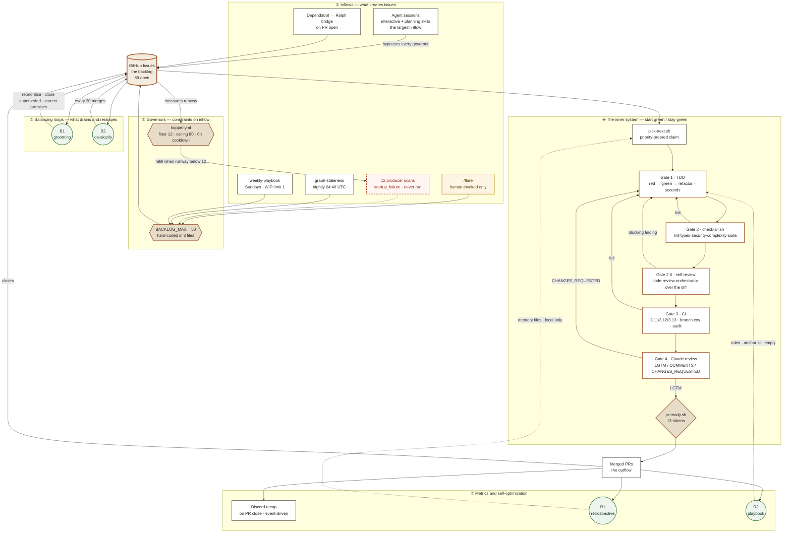

# The loop

A working model of the autonomous development loop that builds Adepthood —
drawn in the conventions of systems thinking, and **drawn as it actually runs**
rather than as it was designed.

Every node is clickable. Follow one into the workflow file, the skill, or the
live run history that produced it.

## The legend

<div class="loop-legend" markdown>

<div class="loop-legend__item" markdown>
**▭ Stock** — an accumulation. Something that fills and drains.
</div>

<div class="loop-legend__item" markdown>
**⬡ Constraint** — a valve on a flow. Caps, floors, cooldowns.
</div>

<div class="loop-legend__item" markdown>
**◯ B** — a *balancing* loop. Pushes the stock back toward a target.
</div>

<div class="loop-legend__item" markdown>
**◯ R** — a *reinforcing* loop. Amplifies. Compounds over time.
</div>

<div class="loop-legend__item loop-legend__item--dead" markdown>
**⌁ Dashed red** — wired but **never fires**. Present in design, absent in reality.
</div>

<div class="loop-legend__item loop-legend__item--human" markdown>
**◇ Amber** — requires a human. The loop stops here until a person acts.
</div>

</div>

---

## The whole system



??? tip "Every node as a plain link"

    The diagram's nodes are clickable. This index is the same set of
    destinations in text — useful on a phone, with a keyboard, or if the
    mermaid runtime fails to load.

    **Inflows** ·
    [/flare](https://github.com/Geoffe-Ga/adepthood/blob/main/.claude/skills/flare/SKILL.md) ·
    [producer scans (run history)](https://github.com/Geoffe-Ga/adepthood/actions/workflows/scan-todo.yml) ·
    [Dependabot bridge](https://github.com/Geoffe-Ga/adepthood/blob/main/.github/workflows/dependabot-to-ralph-issue.yml) ·
    [graph-build](https://github.com/Geoffe-Ga/adepthood/blob/main/.github/workflows/graph-build.yml) ·
    [weekly-playbook](https://github.com/Geoffe-Ga/adepthood/blob/main/.github/workflows/weekly-playbook.yml)

    **Governors** ·
    [drain gate](https://github.com/Geoffe-Ga/adepthood/blob/main/.github/workflows/_claude-scan.yml) ·
    [hopper](https://github.com/Geoffe-Ga/adepthood/blob/main/.github/workflows/hopper.yml)

    **Stock** ·
    [the live backlog](https://github.com/Geoffe-Ga/adepthood/issues)

    **Balancing** ·
    [grooming](https://github.com/Geoffe-Ga/adepthood/blob/main/.github/workflows/scan-groom.yml) ·
    [de-slopify](https://github.com/Geoffe-Ga/adepthood/blob/main/.github/workflows/deslop.yml)

    **Inner system** ·
    [pick-next.sh](https://github.com/Geoffe-Ga/adepthood/blob/main/scripts/ralph/pick-next.sh) ·
    [Gate 1](https://github.com/Geoffe-Ga/adepthood/blob/main/scripts/backend/test.sh) ·
    [Gate 2](https://github.com/Geoffe-Ga/adepthood/blob/main/scripts/backend/check-all.sh) ·
    [Gate 2.5](https://github.com/Geoffe-Ga/adepthood/blob/main/.claude/agents/code-review-orchestrator.md) ·
    [Gate 3](https://github.com/Geoffe-Ga/adepthood/actions/workflows/backend-ci.yml) ·
    [Gate 4](https://github.com/Geoffe-Ga/adepthood/blob/main/.github/workflows/claude-code-review.yml) ·
    [pr-ready.sh](https://github.com/Geoffe-Ga/adepthood/blob/main/scripts/ralph/pr-ready.sh)

    **Outflow** ·
    [every merged PR](https://github.com/Geoffe-Ga/adepthood/pulls?q=is%3Apr+is%3Amerged)

    **Metrics** ·
    [Discord recap](https://github.com/Geoffe-Ga/adepthood/blob/main/scripts/ralph/RECAP.md) ·
    [the tick](https://github.com/Geoffe-Ga/adepthood/blob/main/.claude/commands/ralph-tick.md) ·
    [playbook anchor](https://github.com/Geoffe-Ga/adepthood/blob/main/CLAUDE.md)

---

## What is actually running

The diagram above is drawn from run history, not from documentation. Three of
its branches are dark.

!!! quote "Why this model is honest about being broken"

    A model that shows only the intended design is a brochure. A loop diagram
    that hides its dark branches also teaches the wrong lesson about autonomous
    systems: the interesting failures are the quiet ones.

??? danger "⌁ All 12 producer scans — never executed · issue #2259"

    Every scheduled scan reports `startup_failure` with **zero jobs created**, on
    every run in recorded history.

    ```console
    $ gh run list --workflow=scan-todo.yml --limit 3
    scan-todo      startup_failure  startup_failure  startup_failure
    scan-security  startup_failure  startup_failure  startup_failure
    ```

    `startup_failure` produces no job, so there is no red step to open and no log
    to read. The run list shows a neutral entry rather than a failure anybody
    would chase.

    **The consequence for the model:** the scheduled producer half of the inflow
    is absent, and the governors kept measuring a supply that was never arriving.

    An earlier version of this page went further and said the open issues had
    therefore arrived through `/flare` and the Dependabot bridge alone. That was
    wrong, and the correction is the more interesting finding — see below.

    [Read the issue :material-arrow-right:](https://github.com/Geoffe-Ga/adepthood/issues/2259)

??? warning "◯ R2 · The playbook — one completed turn in four attempts"

    The self-improvement loop is designed to distil durable rules from real
    failures each week. Its anchor in `CLAUDE.md` currently reads:

    ```html
    <!-- playbook rules are inserted below this line -->
    ```

    Nothing below it. The first three scheduled runs failed outright; the fourth
    succeeded and produced exactly one delta — which is still unimplemented, and
    because the workflow stands down whenever any `playbook`-labelled issue is
    open, **that one unmerged issue is now blocking the loop that produced it.**

    A WIP limit of one is a defensible design. It also means a single stalled
    delta halts learning entirely.

??? note "◯ R1 · The retrospective — real, but outside the repo"

    The every-10-PRs retrospective genuinely exists and asks what you remember it
    asking: it reviews the session for token burn and for moments the operator
    had to intervene, then writes durable memory files.

    But it lives at `~/.claude/skills/session-retrospective/`, **outside the
    repository**, and its memory files live in a local project directory. No
    GitHub Actions agent can see any of it. The loop learns locally and forgets
    in CI — which is why it is drawn as a dashed return edge.

---

!!! danger "The largest inflow is the one nobody designed"

    Measured on 2026-08-15: **31 of 94 open issues were filed in the last three
    days**, and `scan:*` labels appear on **zero** issues in the repo's entire
    history — so the scans really never ran, but that is not why the backlog
    fills.

    Most issues are filed by **agent sessions** calling `gh issue create`
    directly: interactive Claude Code sessions, planning skills like
    `/triage-and-plan` that emit whole epic families, and audit passes. They are
    invisible in authorship — an agent using the operator's token is
    indistinguishable from the operator — so they can only be seen by their
    label families: `de-slop` (7 open), `launch-seeding` (6, filed in a single
    pass), `audit-northstar` (5), `priority-medium` (9). None of those belong to
    `/flare`'s vocabulary.

    **This is a genuine hole in the governor model.** `BACKLOG_MAX = 50` is a
    job-level gate inside `_claude-scan.yml`. It restrains the twelve scans and
    nothing else. An agent session filing through `gh` never consults it — so
    the backlog's dominant inflow is completely ungoverned, and the ceiling that
    looks like it caps the system caps only the branch that is already dead.

    Two lessons, and the second is the one worth taking away. First: a model
    built from workflow files sees only the inflows someone thought to automate.
    Second, and more uncomfortable — **this page originally asserted the wrong
    inflow, and the error survived research, verification and publication**
    because I checked whether the scans ran (they don't) and then inferred where
    the issues came from instead of measuring it. Geoff caught it by knowing his
    own repo: *"It CAN'T be true that everything being worked on here is stuff I
    brought up via flare."* The measurement above is what that prompted.

## ① Inflows

Six things create issues. The largest of them appears in no design document.

| Source | Cadence | Status |
| --- | --- | --- |
| **Agent sessions** | Continuous | **Working — and ungoverned** |
| [`deslop.yml`](https://github.com/Geoffe-Ga/adepthood/blob/main/.github/workflows/deslop.yml) | Every 30 merges | Working |
| [`/flare`](https://github.com/Geoffe-Ga/adepthood/blob/main/.claude/skills/flare/SKILL.md) | Human-invoked | Working |
| [Dependabot bridge](https://github.com/Geoffe-Ga/adepthood/blob/main/.github/workflows/dependabot-to-ralph-issue.yml) | On Dependabot PR | Working |
| [`graph-build`](https://github.com/Geoffe-Ga/adepthood/blob/main/.github/workflows/graph-build.yml) staleness | Nightly 04:40 UTC | Working |
| [`weekly-playbook`](https://github.com/Geoffe-Ga/adepthood/blob/main/.github/workflows/weekly-playbook.yml) | Sundays | Stood down |
| **12 producer scans** | Daily → biweekly | **Never run** |

!!! info "`/flare` is not a slash-command file"

    There is no `.claude/commands/flare.md`. `/flare` resolves because `flare` is
    a *skill* name and the Skill tool accepts `/<name>` invocation. Worth knowing
    if you go looking for it.

??? example "The twelve scans and their intended cadences"

    | Scan | Cron | Priority | Cap |
    | --- | --- | --- | --- |
    | [security](https://github.com/Geoffe-Ga/adepthood/blob/main/.github/workflows/scan-security.yml) | Daily 05:00 UTC | P0 | 5 |
    | [deps](https://github.com/Geoffe-Ga/adepthood/blob/main/.github/workflows/scan-deps.yml) | Daily 06:00 UTC | P2 | 5 |
    | [bugs](https://github.com/Geoffe-Ga/adepthood/blob/main/.github/workflows/scan-bugs.yml) | Daily 07:00 UTC | P1 | 4 |
    | [dead-code](https://github.com/Geoffe-Ga/adepthood/blob/main/.github/workflows/scan-dead-code.yml) | Mon 08:00 UTC | P3 | 6 |
    | [complexity](https://github.com/Geoffe-Ga/adepthood/blob/main/.github/workflows/scan-complexity.yml) | Tue 08:00 UTC | P2 | 6 |
    | [coverage](https://github.com/Geoffe-Ga/adepthood/blob/main/.github/workflows/scan-coverage.yml) | Wed 08:00 UTC | P2 | 6 |
    | [perf](https://github.com/Geoffe-Ga/adepthood/blob/main/.github/workflows/scan-perf.yml) | Thu 08:00 UTC | P2 | 5 |
    | [todo](https://github.com/Geoffe-Ga/adepthood/blob/main/.github/workflows/scan-todo.yml) | Fri 08:00 UTC | P3 | 5 |
    | [types](https://github.com/Geoffe-Ga/adepthood/blob/main/.github/workflows/scan-types.yml) | 1st and 15th, 08:00 | P3 | 6 |
    | [docs](https://github.com/Geoffe-Ga/adepthood/blob/main/.github/workflows/scan-docs.yml) | 1st and 15th, 09:00 | P3 | 4 |
    | [mutation](https://github.com/Geoffe-Ga/adepthood/blob/main/.github/workflows/scan-mutation.yml) | 8th and 22nd | P2 | — |
    | [a11y](https://github.com/Geoffe-Ga/adepthood/blob/main/.github/workflows/scan-a11y.yml) | Biweekly | P2 | — |

    All twelve share one engine —
    [`_claude-scan.yml`](https://github.com/Geoffe-Ga/adepthood/blob/main/.github/workflows/_claude-scan.yml)
    — which reads `prompts/scans/<name>.md`, runs read-only analysis, and files
    deduplicated six-component issues. **Scans never push code.** Issues are
    their only durable output, which is what makes them a pure inflow.

---

## ② Governors

Four numbers restrain the inflow, and they do not agree with each other.

<div class="loop-cards" markdown>

<div class="loop-card" markdown>
### BACKLOG_MAX = 50
**Hard stand-down.** At 50 total open issues every producer scan files nothing.

Hard-coded independently in **three** files —
[`_claude-scan.yml`](https://github.com/Geoffe-Ga/adepthood/blob/main/.github/workflows/_claude-scan.yml),
`deslop.yml`, `hopper.yml`. Changing the governor means editing three places.
</div>

<div class="loop-card" markdown>
### MIN_QUEUE = 12
**The refill floor.** When agent-ready runway drops below 12, the
[hopper](https://github.com/Geoffe-Ga/adepthood/blob/main/.github/workflows/hopper.yml)
dispatches a producer scan to top it up.
</div>

<div class="loop-card" markdown>
### MAX_QUEUE = 80
**The drain ceiling.** Above 80 agent-ready issues the hopper stands down and
lets the fleet work the queue down.
</div>

<div class="loop-card" markdown>
### 6-hour cooldown
Per-workflow. Prevents the hopper from re-dispatching the same scan in a tight
loop when the queue stays low.
</div>

</div>

!!! danger "The failure mode this shape hides"

    When the drain gate trips, **the workflow run succeeds.** The gate job sets
    `proceed=false` and the scan job is skipped — so the run shows green.

    Someone scanning run history for red would conclude the scans are healthy and
    filing issues. They are doing neither. This is the same shape as the
    `startup_failure` problem above: *a mechanism that reports success while
    proving nothing.*

---

## ③ Balancing loops

The stock does not only drain by being built. Two loops actively reshape it.

**B1 · Grooming** runs [daily at 04:00 UTC](https://github.com/Geoffe-Ga/adepthood/blob/main/.github/workflows/scan-groom.yml)
*and* every 10 merged completions in the local loop. A pass re-prioritises,
closes issues superseded by shipped work, merges duplicates, and — the one that
matters most — **corrects false premises.** Issues here go stale routinely:
several `agent-ready` tickets have described architecture that had already moved,
and building them faithfully would have produced correct code for a system that
no longer exists.

**B2 · De-slopify** runs every 30 merged completions, pruning accumulated
low-value work.

!!! tip "A number worth correcting"

    Local memory recorded de-slop as running "every 2nd groom, about 20 merges."
    The actual config is `groom_interval: 10`, `deslop_interval: 30` — every
    **third** groom. The diagram uses the config, not the memory. Stale
    documentation about the loop is itself a loop defect.

---

## ④ The inner system

Five gates, each cheaper than the next, each running once.

| | Gate | Command | Cost | On failure |
| --- | --- | --- | --- | --- |
| **1** | Targeted tests (TDD) | `test.sh <paths>` | seconds | *is* the fix loop |
| **2** | Full local ladder | `check-all.sh` | ~4m23s cold · ~8s on receipt | fix in place, re-run |
| **2.5** | Self-review | `code-review-orchestrator` | minutes | back to Gate 1 |
| **3** | CI | GitHub Actions | ~5 min | back to Gate 1 |
| **4** | Claude review | `claude-code-review.yml` | minutes | back to Gate 1 |

??? abstract "Gate 2.5 exists and is not in CLAUDE.md"

    `scripts/ralph/PROMPT.md` heads a step literally titled **"Gate 2 → Gate
    2.5"** and requires dispatching the `code-review-orchestrator` agent over the
    working-tree diff, fixing every blocking finding *before* anything reaches
    CI. It is a real rung that the published four-gate table omits.

??? abstract "Two different fours, and they are not the same four"

    - **The gate model** (`adepthood-constraints.md`): TDD → check-all → CI → Claude review
    - **The ladder** (`CLAUDE.md`): targeted tests → check-all → git hooks → CI

    One has a review rung and no hooks; the other has hooks and no review. Both
    are called "the four gates." The diagram draws the union, which is five.

??? abstract "Failure returns to Gate 1 is doctrine, not mechanism"

    The house rules say it plainly — fix the root cause with a failing-test-first
    cycle, re-clear Gate 2 locally, then climb again. But **no script enforces
    it.** Nothing routes a failed gate back into TDD; a formatting-only failure is
    honestly fixed in place. The return arrows in the diagram are a norm the
    agents follow, not a rail the system provides.

??? abstract "The receipt that makes Gate 2 nearly free — for the backend only"

    Gate 2 fingerprints the tree (`scripts/`, `.pre-commit-config.yaml`, the
    interpreter, `pip freeze`) and skips work already proven green: ~4m23s cold
    becomes ~8s on a hit.

    Two caveats the number hides. **Security checks always run in full** —
    `pip-audit` consults an advisory database that changes without the tree
    changing, so a receipt must never suppress it. And **the frontend has no
    receipt at all**; every frontend run is a cold run.

### The merge decision

[`pr-ready.sh`](https://github.com/Geoffe-Ga/adepthood/blob/main/scripts/ralph/pr-ready.sh)
collapses the whole state of a PR into **one of thirteen tokens** — not three:

<div class="loop-tokens" markdown>
`ready` · `ready-unreviewed` · `behind` · `unknown` · `draft` · `blocked` ·
`conflicted` · `pending` · `ci-failed` · `changes-requested` ·
`awaiting-review` · `review-self-skipped` · `optout`
</div>

Each names a *different remedy*. `behind` wants a sync; `conflicted` wants a real
resolution; `blocked` cannot be fixed by pushing at all. Collapsing them would
send an agent to do the wrong thing confidently — the recurring theme of this
whole system.

!!! warning "Gate 4 is not a GitHub approval"

    No `state == "APPROVED"` is ever set, and the base branch enforces no
    required checks. The verdict is a **comment** that tooling parses — which
    means a review posted to the wrong PR is indistinguishable from a real one.
    That happened, and is now guarded by requiring the reviewer to report which
    PR it actually read.

---

## ⑤ Metrics

**The Discord recap is event-driven, not scheduled.** It fires on
`pull_request: closed` with `merged == true` — deliberately, because a
`push: main` trigger would also fire on hotfixes and reverts.

??? example "What the recap reports"

    - The merged PR: number, title, author, and the issue it closed
    - Cycle time — issue open to PR merged
    - Gate outcomes and where the run spent its time
    - Cumulative completions (currently 716) and the streak
    - Knowledge-graph freshness: node and edge counts, and the age of the semantic layer

    Detail lives in
    [`RECAP.md`](https://github.com/Geoffe-Ga/adepthood/blob/main/scripts/ralph/RECAP.md).

**The retrospective** asks, every ~10 PRs: where were tokens misspent? Where did
the operator have to intervene, and how could that intervention be designed away?
Its output is durable memory — the reason a mistake made on Tuesday is not
repeated on Thursday.

---

## What the model teaches

Three properties of this system are worth more than its throughput.

**Governors are invisible when they work.** Both the drain gate and the dead
scans present as green. A supervisory loop that cannot signal its own inaction is
indistinguishable from one that has nothing to do — and the fix is not a better
threshold, it is making stand-down *visible*.

**The learning loops are the fragile ones.** The build loop has run 716 times.
The playbook has completed one turn in four attempts, and the retrospective's
memory cannot reach CI at all. Reinforcing loops compound only if they close;
these mostly do not, yet.

**The expensive failures are quiet.** Every serious defect this audit surfaced —
scans that never ran, a review posted to the wrong PR, a test fixture writing to
the real repository, guards that pass while proving nothing — shares one shape: a
mechanism reporting success it has not earned. Systems thinking has a name for
watching the wrong variable. This is what it looks like in a delivery pipeline.

---

<small>
Drawn from run history, workflow files and skill definitions on 2026-08-14 ·
sources linked inline · corrections welcome via
[`/flare`](https://github.com/Geoffe-Ga/adepthood/blob/main/.claude/skills/flare/SKILL.md)
</small>

<style>
.loop-legend {
  display: grid;
  grid-template-columns: repeat(auto-fit, minmax(15rem, 1fr));
  gap: .6rem;
  margin: 1.2rem 0 1.6rem;
}
.loop-legend__item {
  border: 1px solid var(--md-default-fg-color--lightest);
  border-left: 3px solid var(--md-primary-fg-color);
  border-radius: .2rem;
  padding: .55rem .75rem;
  font-size: .78rem;
  line-height: 1.45;
  background: var(--md-code-bg-color);
  transition: transform .12s ease, box-shadow .12s ease;
}
.loop-legend__item:hover {
  transform: translateY(-2px);
  box-shadow: 0 3px 10px rgba(0, 0, 0, .09);
}
.loop-legend__item--dead { border-left-color: #c0392b; }
.loop-legend__item--human { border-left-color: #b8860b; }

.loop-cards {
  display: grid;
  grid-template-columns: repeat(auto-fit, minmax(16rem, 1fr));
  gap: .8rem;
  margin: 1rem 0;
}
.loop-card {
  border: 1px solid var(--md-default-fg-color--lightest);
  border-radius: .25rem;
  padding: .3rem 1rem 1rem;
  background: var(--md-code-bg-color);
  transition: transform .12s ease, box-shadow .12s ease;
}
.loop-card:hover {
  transform: translateY(-2px);
  box-shadow: 0 4px 14px rgba(0, 0, 0, .10);
}
.loop-card h3 {
  margin-top: .8rem;
  font-size: .82rem;
  letter-spacing: .02em;
}

.loop-tokens {
  font-family: var(--md-code-font-family, monospace);
  font-size: .74rem;
  line-height: 2.1;
  padding: .7rem .9rem;
  background: var(--md-code-bg-color);
  border-radius: .25rem;
  border-left: 3px solid var(--md-primary-fg-color);
}

.mermaid { margin: 1.4rem 0; }
.mermaid .node { cursor: pointer; }
.mermaid .node:hover rect,
.mermaid .node:hover polygon,
.mermaid .node:hover circle {
  filter: brightness(.97) saturate(1.15);
}
.mermaid .cluster rect { opacity: .55; }
</style>
