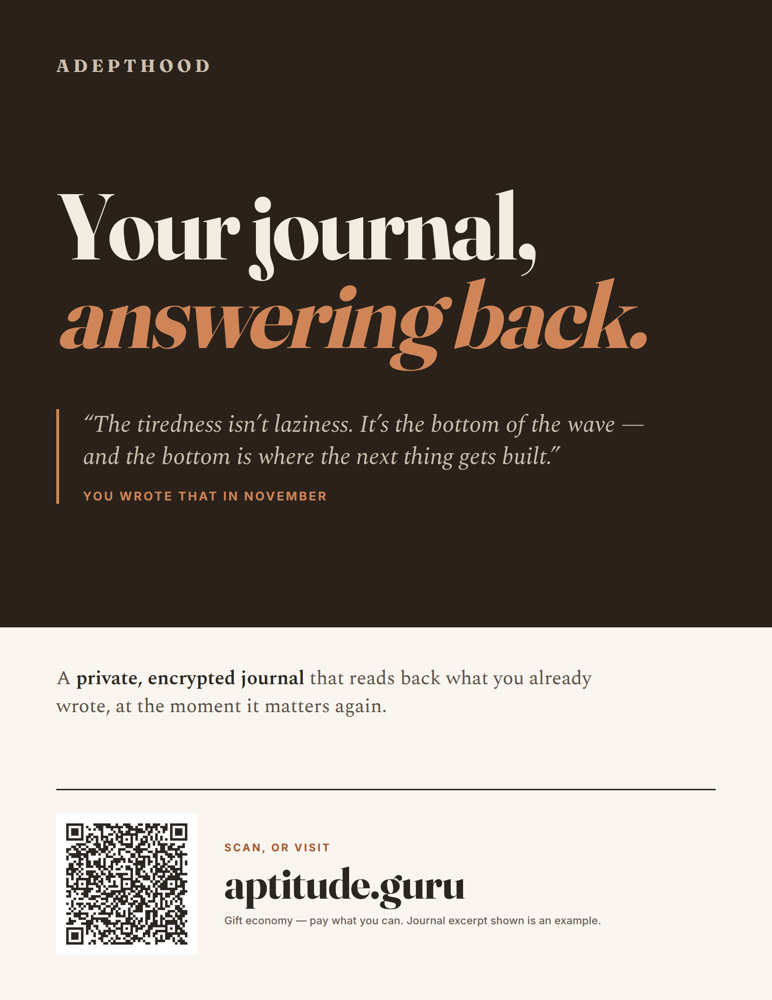
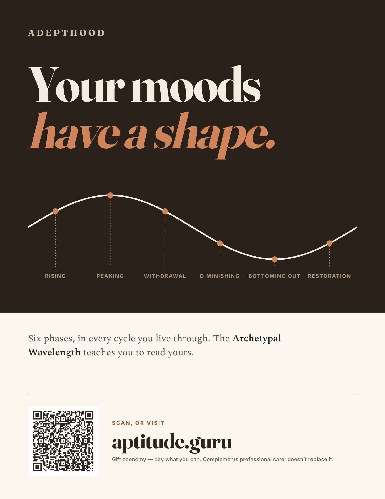
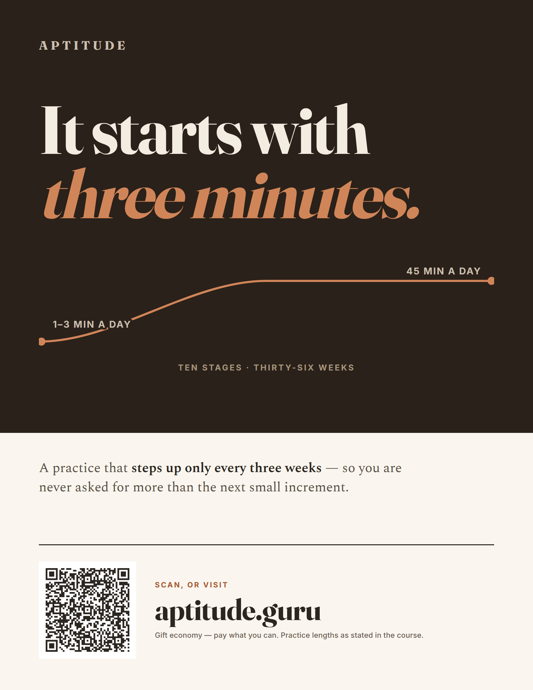

# Promotional flyers

Print artefacts for public noticeboards — libraries, grocery and co-op
community boards, yoga and movement studios. Source, build script and the
full claim-provenance table live in `marketing/flyers/` in the adepthood
repo; this page exists so the artwork can be looked at in a browser before
anything is sent to a printer.

They wear [Candle & Ink](candle-and-ink.md): the posters use its warm-dark
`showcase` / `onShowcase` layer, with the terracotta lifted to `#d08558` so
it clears WCAG AA on the umber ground.

## Posters — for a wall you walk past

One idea readable across a room; the proof only rewards whoever stops. The
deep umber field is doing a job — on a corkboard otherwise covered in white
paper, a dark sheet reads as an object rather than another notice.

### Libraries, bookshops, writing groups

"Your journal, answering back." Leads with the product's own payload: a
margin note the app surfaces from your earlier writing.
[Print-ready PDF](flyers/poster-1-library.pdf)

### Grocery and co-op community boards

"Your moods have a shape." One full cycle of the
[Archetypal Wavelength](archetypal-wavelength-and-aptitude.md) with its six
phases marked. [Print-ready PDF](flyers/poster-2-grocery.pdf)

### Yoga, meditation and movement studios

"It starts with three minutes." The practice ramp, from the course's stated
floor of 1–3 minutes a day to its stated destination of 45.
[Print-ready PDF](flyers/poster-3-studio.pdf)

## Handouts — for a table, a counter, or a hand

The same three pitches at editorial length. Too much text for a wall; right
for something somebody picks up and takes away.

| Venue | Proof | PDF |
| --- | --- | --- |
| Libraries | [view](flyers/handout-1-library.png) | [print](flyers/handout-1-library.pdf) |
| Community boards | [view](flyers/handout-2-grocery.png) | [print](flyers/handout-2-grocery.pdf) |
| Studios | [view](flyers/handout-3-studio.png) | [print](flyers/handout-3-studio.pdf) |

## Attribution of scans

Each of the six carries its own QR, so a scan identifies both the venue and
the format. The targets are standard UTM parameters on `aptitude.guru`,
which analytics platforms parse into their own columns with no change to
the site — `utm_campaign` names the venue, `utm_source` the format.

| Flyer | `utm_source` | `utm_campaign` |
| --- | --- | --- |
| poster-1-library | `poster` | `library` |
| poster-2-grocery | `poster` | `grocery` |
| poster-3-studio | `poster` | `studio` |
| handout-1-library | `handout` | `library` |
| handout-2-grocery | `handout` | `grocery` |
| handout-3-studio | `handout` | `studio` |

`utm_medium` is `print` throughout. The exact strings are checked into
`marketing/flyers/assets/qr-targets.json`, and `verify-qr.py` samples the
module grid out of each rendered page to confirm the printed symbol decodes
back to the intended URL — posters at 0.69 mm per module, handouts at
0.53 mm, both above the 0.4 mm floor for phone cameras.

## What the flyers claim, and what they withhold

Every factual claim is traced to a source file in the ecosystem repos; the
table lives in `marketing/flyers/README.md`. Three things are deliberately
absent for want of a reliable source:

- **No per-stage minute ladder.** The progression in adepthood's `CLAUDE.md`
  is contradicted by the Clear Light stage text, which discusses 75- and
  90-minute sits. The flyers show the shape of the climb and label only the
  two figures the course states outright.
- **No app-store availability.** `DEPLOYMENT.md` verifies the web origin
  only.
- **Nothing implying free access.** Account creation verifies an APTITUDE
  licence, so no flyer suggests otherwise.

Two things need confirming before a print run: that the Gumroad listing is
actually configured for pay-what-you-want pricing, since all six footers say
"gift economy — pay what you can"; and that `aptitude.guru` explains the
offer and leads to purchase, since it is the QR target for all six.
