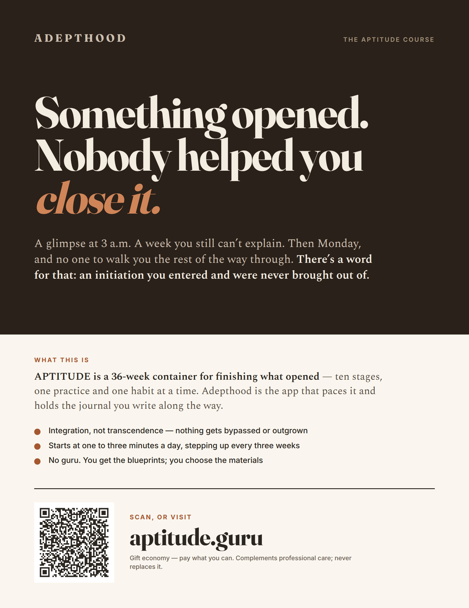
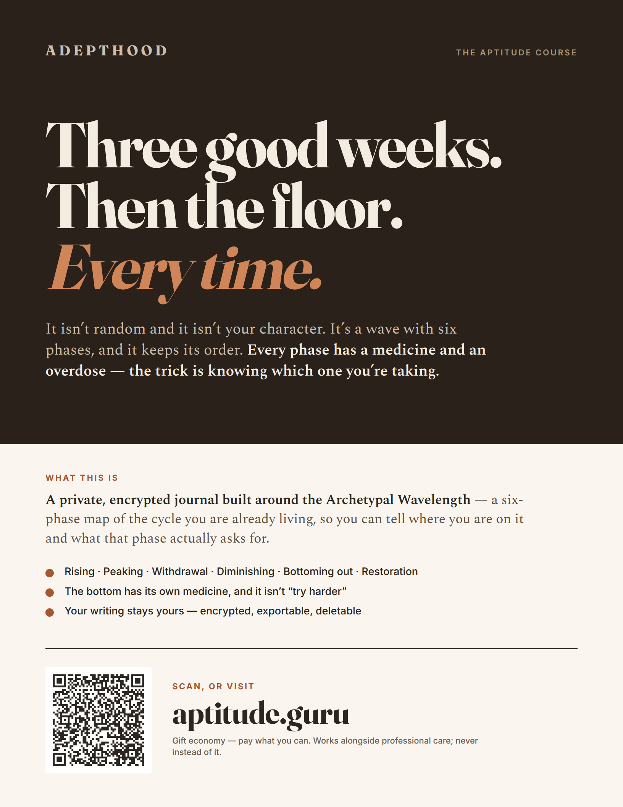
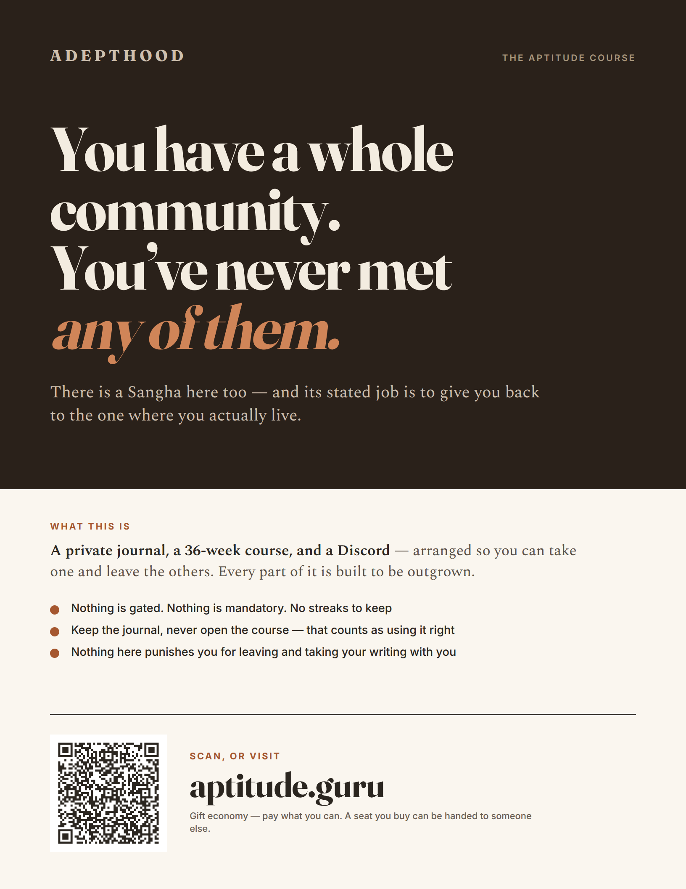
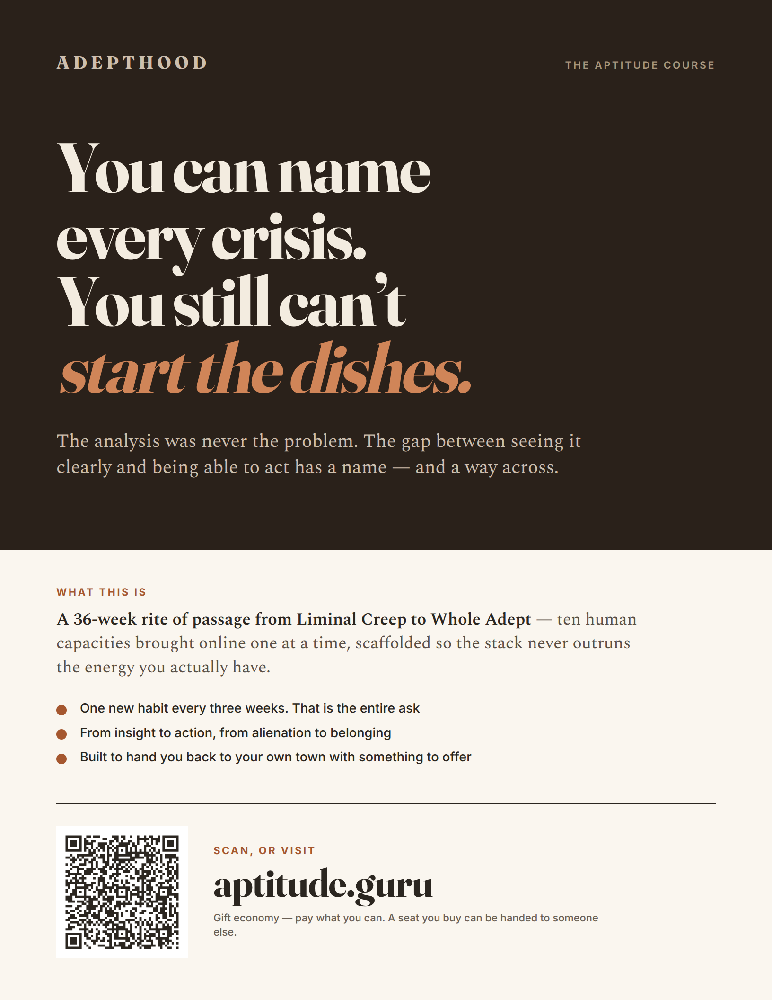

# Promotional flyers

Print artefacts for public noticeboards. Four wall posters — one for each
user story in the Adepthood north star — plus three long-form handouts.
Source, build script and the full claim-provenance table live in
`marketing/flyers/` in the adepthood repo; this page exists so the artwork
can be looked at in a browser before anything is sent to a printer.

They wear [Candle & Ink](candle-and-ink.md): the posters use its warm-dark
`showcase` / `onShowcase` layer, with the terracotta lifted to `#d08558` so
it clears WCAG AA on the umber ground.

## How a poster is built

A product claim does not stop the reader these are aimed at; recognition
does. So each poster runs five zones, in the order a passer-by takes them:

1. **Hook** — huge, and a line of recognition rather than a benefit claim.
2. **Turn** — one line: *there is a name for this*.
3. **Pitch** — what the thing actually is, in one sentence.
4. **Points** — three specifics that make the pitch believable.
5. **Ask** — QR, URL, terms.

About ninety words each: two seconds to stop, twenty to read.

## The four posters

### Insight integration — the Householder Shaman

For the reader carrying openings they entered and were never walked out of.
Suits yoga and meditation studios, metaphysical shops, herbalists.
[Print-ready PDF](flyers/poster-1-initiation.pdf)

### The user manual — the Neurospicy reader

For the reader whose moods arrive on a schedule nobody has ever explained to
them. Suits grocery and co-op boards, libraries, waiting rooms.
[Print-ready PDF](flyers/poster-2-moods.pdf)

### The Digital Sangha — the chronically online

For the reader with a people online and nobody local — and the promise that
the Sangha's job is to hand them back. Suits coffee shops, co-working, game
and record shops. [Print-ready PDF](flyers/poster-3-sangha.pdf)

### Agency — the Liminal Creep becoming a Whole Adept

For the reader who can analyse every system and still cannot start. Suits
libraries, bookshops, mutual-aid and organising boards.
[Print-ready PDF](flyers/poster-4-agency.pdf)

## Handouts

The three topics at editorial length — too much text for a wall, right for
something picked up and taken away.

| Topic | Proof | PDF |
| --- | --- | --- |
| The journal and its margin notes | [view](flyers/handout-1-journal.png) | [print](flyers/handout-1-journal.pdf) |
| The Archetypal Wavelength | [view](flyers/handout-2-wavelength.png) | [print](flyers/handout-2-wavelength.pdf) |
| The course and its practice ramp | [view](flyers/handout-3-course.png) | [print](flyers/handout-3-course.pdf) |

## Attribution of scans

Each of the seven carries its own QR, so a scan identifies both the flyer and
the format. The targets are standard UTM parameters on `aptitude.guru`, which
analytics platforms parse into their own columns with no change to the site.

| Flyer | `utm_source` | `utm_campaign` |
| --- | --- | --- |
| poster-1-initiation | `poster` | `initiation` |
| poster-2-moods | `poster` | `moods` |
| poster-3-sangha | `poster` | `sangha` |
| poster-4-agency | `poster` | `agency` |
| handout-1-journal | `handout` | `journal` |
| handout-2-wavelength | `handout` | `wavelength` |
| handout-3-course | `handout` | `course` |

`utm_medium` is `print` throughout. The exact strings are checked into
`marketing/flyers/assets/qr-targets.json`, and `verify-qr.py` samples the
module grid out of each rendered page to confirm the printed symbol decodes
back to the intended URL — posters at 0.65 mm per module, handouts at
0.53 mm, both above the 0.4 mm floor for phone cameras.

## What the flyers claim, and what they withhold

The hooks are advertising copy addressed to a reader, not assertions of fact.
Everything below the hook is, and each line traces to a source file; the
table lives in `marketing/flyers/README.md`. Three things are deliberately
absent for want of a reliable source:

- **No per-stage minute ladder.** The progression in adepthood's `CLAUDE.md`
  is contradicted by the Clear Light stage text, which discusses 75- and
  90-minute sits. The flyers name only the figures the course states
  outright.
- **No app-store availability.** `DEPLOYMENT.md` verifies the web origin
  only.
- **Nothing implying free access.** Account creation verifies an APTITUDE
  licence, so no flyer suggests otherwise.

Two things need confirming before a print run: that the Gumroad listing is
actually configured for pay-what-you-want pricing, since all seven footers
say "gift economy — pay what you can"; and that `aptitude.guru` explains the
offer and leads to purchase, since it is the QR target for all seven.
