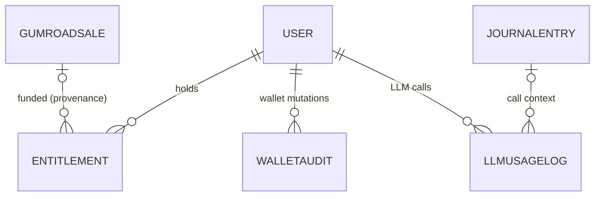

# Data model — commerce & wallet

Models: `Entitlement`, `GumroadSale`, `WalletAudit`, `LLMUsageLog` — paid
access, verbatim Gumroad webhook persistence, the append-only wallet
ledger, and per-request LLM cost accounting.



## `Entitlement` (`backend/src/models/entitlement.py`)

The "may access paid content" ledger: one row per grant of one access
kind (today only `course_access`), with provenance and lifecycle. A
dedicated table rather than a boolean on `User` because entitlements have
their own lifecycle and more kinds are anticipated
(`entitlement.py:1-8`).

| Field | Type | Constraints / column | Default | Purpose |
| --- | --- | --- | --- | --- |
| `id` | `int \| None` | primary key | `None` | Grant id (`entitlement.py:78`) |
| `user_id` | `int` | FK `user.id`, `ondelete="CASCADE"`, index | — | Grantee (`entitlement.py:79`) |
| `kind` | `str` | `max_length=32`, CHECK `ck_entitlement_kind_valid` | `"course_access"` | `EntitlementKind` value; new kinds extend the enum and the derived CHECK follows (`entitlement.py:27-41,80`) |
| `product_id` | `str \| None` | — | `None` | The Gumroad SKU that funded the grant; manual grants omit it (`entitlement.py:81-82`) |
| `source_sale_id` | `int \| None` | FK `gumroadsale.id`, nullable, **no** ondelete cascade | `None` | Provenance, not a dependency — deleting a sale row must never silently revoke access (`entitlement.py:83-88`) |
| `granted_at` | `datetime` | `DateTime(timezone=True)`, not null | `datetime.now(UTC)` | Grant instant (`entitlement.py:89-92`) |
| `revoked_at` | `datetime \| None` | nullable | `None` | Revocation instant (`entitlement.py:93`) |
| `entitlement_metadata` | `dict[str, object]` | `JSON`, not null, DB column named `metadata` | `{}` | Extensibility bag; SQLModel reserves the attribute name `metadata`, hence the attribute/column split (`entitlement.py:60-63,96-99`) |

At most one *active* entitlement per `(user_id, kind)` — partial unique
index `ix_entitlement_user_kind_active` WHERE `revoked_at IS NULL`, so
revoke-then-regrant always works while revoked history accumulates
(`entitlement.py:55-58,66-76`). Migration:
`a6b7c8d9e0f1_add_entitlement` (`backend/migrations/versions/`). Rules
in [domain/entitlements](../domain/entitlements.md).

## `GumroadSale` (`backend/src/models/gumroad_sale.py`)

Verbatim persistence of Gumroad ping webhooks: one row per ping, keyed by
Gumroad's `sale_id` so webhook replays collapse onto the existing row.
Typed columns cover fields current features read; `raw_payload` keeps the
posted form intact (Gumroad sends booleans as the strings
`"true"`/`"false"`, and those strings are preserved) so later features
can re-derive anything without asking Gumroad to resend history
(`gumroad_sale.py:1-7,41-42`).

| Field | Type | Constraints / column | Default | Purpose |
| --- | --- | --- | --- | --- |
| `id` | `int \| None` | primary key | `None` | Row id (`gumroad_sale.py:33`) |
| `gumroad_sale_id` | `str` | `unique`, index | — | Gumroad's sale_id — the webhook idempotency key (`gumroad_sale.py:34-35`) |
| `product_id` | `str` | — | — | SKU sold (`gumroad_sale.py:36`) |
| `email` | `str` | — | — | Buyer email (`gumroad_sale.py:37`) |
| `resource_name` | `str` | — | — | Ping type; only `"sale"` (`SALE_RESOURCE_NAME`, `gumroad_sale.py:24-27`) carries entitlement/wallet side effects (`gumroad_sale.py:38`) |
| `is_recurring_charge` | `bool` | — | `False` | Subscription renewal flag (`gumroad_sale.py:39`) |
| `refunded` | `bool` | — | `False` | Refund flag from the ping (`gumroad_sale.py:40`) |
| `raw_payload` | `dict[str, str]` | `JSON`, not null | `{}` | The posted form exactly as received (`gumroad_sale.py:43-46`) |
| `created_at` | `datetime` | `DateTime(timezone=True)`, not null | `datetime.now(UTC)` | Receipt instant (`gumroad_sale.py:47-50`) |
| `token_pack_credited_at` | `datetime \| None` | nullable | `None` | Exactly-once wallet-credit guard — see below (`gumroad_sale.py:51-58`) |
| `token_pack_credited_user_id` | `int \| None` | FK `user.id`, `ondelete="SET NULL"`, index, nullable | `None` | Which account received the pack; SET NULL so the financial trail survives account deletion (`gumroad_sale.py:59-69`) |
| `revocation_processed_at` | `datetime \| None` | nullable | `None` | Exactly-once reversal guard shared by refund/dispute/cancellation events (`gumroad_sale.py:70-78`) |

The two guard columns are the load-bearing concurrency design
(`backend/src/models/gumroad_sale.py:51-54,70-74`):

```python
    # The token-pack claim guard. NULL means "no wallet credit has been taken
    # for this sale yet"; a guarded UPDATE stamps it, so only one writer can
    # ever move the credits. It deliberately outlives the crediting account:
    # a deleted-then-re-registered email must not re-mint the same pack.
    ...
    # The reversal claim guard, shared by every event that unwinds a purchase.
    # NULL means "nothing has reversed this sale yet"; a guarded UPDATE stamps
    # it, so the refund and the cancellation of the same subscription cannot
    # both revoke.
```

**Migrations**: `d0e1f2a3b4c6_add_gumroad_sale`,
`b8c9d0e1f2a3_gumroad_sale_token_pack_credit`
(`backend/migrations/versions/`).

## `WalletAudit` (`backend/src/models/wallet_audit.py`)

Append-only audit log for every wallet mutation (BUG-BM-011): one row per
`offering_balance` / `monthly_messages_used` change. Intentionally not
exposed via the API — a forensic surface read by ops via direct SQL
(`wallet_audit.py:1-6`). Append-only is enforced at the application layer
(`services.wallet` only ever inserts); operators wanting DB-level
defence-in-depth should `REVOKE UPDATE, DELETE` from the application role
in deployment (the role name is environment-specific, so it is not
embedded in the migration) (`wallet_audit.py:8-16`).

| Field | Type | Constraints / column | Default | Purpose |
| --- | --- | --- | --- | --- |
| `id` | `int \| None` | primary key | `None` | Row id (`wallet_audit.py:117`) |
| `user_id` | `int` | FK `user.id`, index, `ondelete="CASCADE"` | — | Wallet owner (`wallet_audit.py:118`) |
| `actor_user_id` | `int \| None` | FK `user.id`, index, `ondelete="SET NULL"`, nullable | `None` | Who initiated the change; SET NULL so an admin's deletion does not destroy audit rows for actions on other users' wallets (`wallet_audit.py:119-131`) |
| `bucket` | `str` | `String(64)`, not null, index | — | `monthly` or `offering` (`BUCKET_MONTHLY`/`BUCKET_OFFERING`, `wallet_audit.py:70-75,132-134`) |
| `reason` | `str` | `String(64)`, not null, index | — | Symbolic reason token — see table below (`wallet_audit.py:135-137`) |
| `delta` | `Decimal` | `Numeric(18,6)`, not null | — | Signed change (`wallet_audit.py:138-140`) |
| `balance_before` | `Decimal` | `Numeric(18,6)`, not null | — | Balance before (`wallet_audit.py:141-143`) |
| `balance_after` | `Decimal` | `Numeric(18,6)`, not null | — | Balance after (`wallet_audit.py:144-146`) |
| `created_at` | `datetime` | not null, index, `server_default=func.now()` | `datetime.now(UTC)` | Defence-in-depth default so a raw ops `INSERT` omitting it lands cleanly (`wallet_audit.py:147-159`) |

Reason tokens are module constants so the service layer references
symbolic names, and analytics can group by reason
(`wallet_audit.py:26-32`):

| Constant | Value | Meaning |
| --- | --- | --- |
| `REASON_SPEND_MONTHLY` | `spend_monthly` | Free-bucket message spend (`wallet_audit.py:33`) |
| `REASON_SPEND_OFFERING` | `spend_offering` | Paid-bucket message spend (`wallet_audit.py:34`) |
| `REASON_ADMIN_GRANT` | `admin_grant` | Admin granted credits to *another* user (`actor_user_id != user_id`) (`wallet_audit.py:35-40`) |
| `REASON_SELF_GRANT` | `self_grant` | Courtesy self top-up (`wallet_audit.py:41`) |
| `REASON_MONTHLY_RESET` | `monthly_reset` | First-of-month rollover zeroing `monthly_messages_used`; recorded so reconciliation holds (`wallet_audit.py:42-50`) |
| `REASON_GUMROAD_PURCHASE` | `gumroad_purchase` | Paid token pack credited to the offering bucket (`wallet_audit.py:51-58`) |
| `REASON_GUMROAD_REFUND` | `gumroad_refund` | Claw-back; deliberately unclamped, so the balance can go below zero — "spending the credits first must not make the refund cheaper" (`wallet_audit.py:59-68`) |

The sign convention makes reconciliation a single SQL query
(`backend/src/models/wallet_audit.py:99-112`):

```python
    * ``BUCKET_MONTHLY`` rows use a *count-up* convention.  A
      ``REASON_SPEND_MONTHLY`` row records ``delta = +1`` (the
      counter rose by one).  A ``REASON_MONTHLY_RESET`` row records
      ``delta = -before`` (the counter dropped from ``before`` to 0).
      ``SUM(delta WHERE bucket='monthly')`` over a calendar month
      therefore yields zero -- spends and the rollover net out ...
    * ``BUCKET_OFFERING`` rows use a *credit-balance* convention.  A
      grant records ``delta = +amount``; a spend records ``delta = -1``.
      ``SUM(delta WHERE bucket='offering')`` is the user's current
      offering balance from the audit log alone ...
```

**Migrations**: `e1f2a3b4c5d6_decimal_cost_and_wallet_audit`,
`f3a4b5c6d7e8_add_user_fk_ondelete` (`backend/migrations/versions/`).

## `LLMUsageLog` (`backend/src/models/llm_usage_log.py`)

Per-request LLM cost + token accounting: one row per successful LLM call
(journal resonance / essay generation), append-only, doubling as an audit
log for cost investigations; aggregates are computed on read by the admin
stats endpoint (`llm_usage_log.py:1-8`).

| Field | Type | Constraints / column | Default | Purpose |
| --- | --- | --- | --- | --- |
| `id` | `int \| None` | primary key | `None` | Row id (`llm_usage_log.py:58`) |
| `user_id` | `int` | FK `user.id`, index, `ondelete="CASCADE"` | — | Caller (`llm_usage_log.py:59`) |
| `timestamp` | `datetime` | not null, index | `datetime.now(UTC)` | Call instant (`llm_usage_log.py:60-63`) |
| `provider` | `str` | `max_length=32`, index | — | LLM provider (`llm_usage_log.py:64`) |
| `model` | `str` | `max_length=128`, index | — | Model id (`llm_usage_log.py:65`) |
| `prompt_tokens` | `int` | `ge=0` | `0` | Input tokens (`llm_usage_log.py:66`) |
| `completion_tokens` | `int` | `ge=0` | `0` | Output tokens (`llm_usage_log.py:67`) |
| `total_tokens` | `int` | `ge=0` | `0` | Total tokens (`llm_usage_log.py:68`) |
| `estimated_cost_usd` | `Decimal \| None` | `Numeric(12,6)`, nullable | `None` (`DEFAULT_COST`) | Derived from tokens via `services.llm_pricing`; stored so historical rows survive pricing-table updates (`llm_usage_log.py:39-42,69-72`) |
| `journal_entry_id` | `int \| None` | FK `journalentry.id`, index | `None` | The entry the call was about; `None` for stateless calls (e.g. transcription) (`llm_usage_log.py:50-55,73`) |

`estimated_cost_usd` is `Decimal` (BUG-ADMIN-004 / BUG-BM-008) so
aggregate sums are exact; `None` means "unknown model — pricing table
missed it" and is logged as a warning rather than silently averaged in as
$0, which the previous float default did (`llm_usage_log.py:44-48`).
Migration: `e1f2a3b4c5d6_decimal_cost_and_wallet_audit`
(`backend/migrations/versions/`).

## Related

- [api/gumroad](../api/gumroad.md), [api/admin](../api/admin.md),
  [api/botmason](../api/botmason.md)
- [domain/entitlements](../domain/entitlements.md)

---

*Grounded in adepthood@fbc529d, 2026-07-31.*
