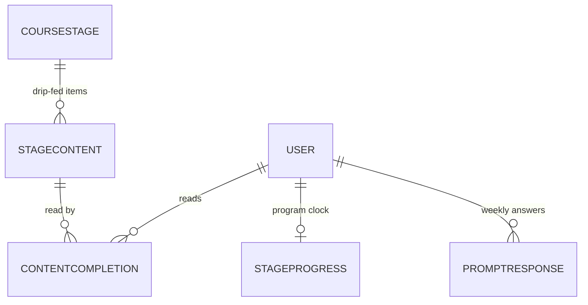

# Data model — course & program progress

Models: `CourseStage`, `StageContent`, `StageProgress`,
`ContentCompletion`, `PromptResponse` — the course-reading ring and the
per-user program clock.



## `CourseStage` (`backend/src/models/course_stage.py`)

One educational stage of the APTITUDE course, with metadata for
curriculum organisation, contextual theory (Spiral Dynamics color,
developmental stage), and display (`course_stage.py:4-10`). Rows are
seeded from `backend/src/seed_stages.py` at startup — see
[infrastructure](../infrastructure.md).

| Field | Type | Constraints | Default | Purpose |
| --- | --- | --- | --- | --- |
| `id` | `int \| None` | primary key | `None` | Stage id (`course_stage.py:12`) |
| `title` | `str` | — | — | Stage title (`course_stage.py:13`) |
| `subtitle` | `str` | — | — | Stage subtitle (`course_stage.py:14`) |
| `stage_number` | `int` | — | — | 1-based stage ordinal (`course_stage.py:15`) |
| `overview_url` | `str` | — | — | Link to the stage overview content (`course_stage.py:16`) |
| `category` | `str` | — | — | Curriculum grouping (`course_stage.py:17`) |
| `aspect` | `str` | — | — | Aspect of Wholeness (`course_stage.py:18`) |
| `spiral_dynamics_color` | `str` | — | — | e.g. BEIGE…CLEAR LIGHT (`course_stage.py:19`) |
| `growing_up_stage` | `str` | — | — | Developmental-stage label (`course_stage.py:20`) |
| `divine_gender_polarity` | `str` | — | — | Theory metadata (`course_stage.py:21`) |
| `relationship_to_free_will` | `str` | — | — | Theory metadata (`course_stage.py:22`) |
| `free_will_description` | `str` | — | — | Theory metadata (`course_stage.py:23`) |

No explicit length caps or extra constraints are declared on this table —
all columns take SQLModel's defaults (`course_stage.py:12-23`).

## `StageContent` (`backend/src/models/stage_content.py`)

Individual content entries (essays, prompts, videos) tied to a course
stage, scheduled by days since the user began the stage
(`stage_content.py:4-8`).

| Field | Type | Constraints | Default | Purpose |
| --- | --- | --- | --- | --- |
| `id` | `int \| None` | primary key | `None` | Content id (`stage_content.py:10`) |
| `course_stage_id` | `int` | FK `coursestage.id` | — | Parent stage (`stage_content.py:11`) |
| `title` | `str` | — | — | Item title (`stage_content.py:12`) |
| `content_type` | `str` | — | — | `"essay"`, `"prompt"`, `"video"`, … (free string; no CHECK) (`stage_content.py:13`) |
| `release_day` | `int` | — | — | Days-into-stage gate for drip-feed (`stage_content.py:14`) |
| `url` | `str` | — | — | Content location (`stage_content.py:15`) |

## `StageProgress` (`backend/src/models/stage_progress.py`)

The per-user program clock: current stage, completed stages, and the
anchors every stage/week calendar derivation keys off. One row per user
(`user_id` unique, `stage_progress.py:49`).

| Field | Type | Constraints / column | Default | Purpose |
| --- | --- | --- | --- | --- |
| `id` | `int \| None` | primary key | `None` | Row id (`stage_progress.py:23`) |
| `current_stage` | `int` | — | — | Stage currently worked on (`stage_progress.py:24`) |
| `completed_stages` | `list[int]` | `ARRAY(Integer)`, not null | `[]` | Completed stage numbers (`stage_progress.py:25-28`) |
| `stage_started_at` | `datetime` | `DateTime(timezone=True)`, not null | `datetime.now(UTC)` | When the current stage began (`stage_progress.py:29-32`) |
| `program_started_at` | `datetime \| None` | `DateTime(timezone=True)`, nullable | `datetime.now(UTC)` | Program-wide start anchor (issue #386) — see below (`stage_progress.py:33-42`) |
| `cycle_number` | `int` | `ge=1`, CHECK `ck_stageprogress_cycle_number_positive` | `1` | Loop index for the 36-week arc (`stage_progress.py:16,43-44`) |
| `highest_stage_reached` | `int` | `ge=1`, CHECK `ck_stageprogress_highest_stage_reached_positive` | `1` | Lifetime high-water mark — see below (`stage_progress.py:17-20,45-48`) |
| `user_id` | `int` | FK `user.id`, `unique`, `ondelete="CASCADE"` | — | One row per user (`stage_progress.py:49`) |

Two columns carry non-obvious semantics:

- `program_started_at` is the single date every stage/week calendar
  derivation keys off, mirroring the frontend's `programStartDate`. It is
  nullable for legacy rows; the migration
  (`18c9d0e1f2a3_add_program_started_at`) backfills from the earliest
  habit start date (else `stage_started_at`), and
  `resolve_program_anchor` in
  [domain/program-calendar](../domain/program-calendar.md) falls back at
  read time for anything the backfill missed (`stage_progress.py:33-38`).
- `highest_stage_reached` is monotone — "bumped on advance, never cleared
  by begin-again — so a Return stays eligible from any current stage once
  Blue was ever passed" (`stage_progress.py:45-47`); consumed by
  [domain/metta-return](../domain/metta-return.md).

**Migrations**: `18c9d0e1f2a3_add_program_started_at`,
`f2a3b4c5d6e8_add_stageprogress_cycle_number`,
`d3e4f5a6b7c8_add_stageprogress_highest_stage_reached`,
`c0d1e2f3a4b5_audit_completed_stages_gaps`
(`backend/migrations/versions/`).

## `ContentCompletion` (`backend/src/models/content_completion.py`)

Records that a user has read a specific content item. The DB-level
uniqueness closes a race (BUG-COURSE-002)
(`backend/src/models/content_completion.py:20-22`):

```python
    __table_args__ = (
        UniqueConstraint("user_id", "content_id", name="uq_contentcompletion_user_content"),
    )
```

Without it, the application-level pre-check in `mark_content_read` was
racy: two concurrent calls could both pass the existence check and both
insert (`content_completion.py:12-18`).

| Field | Type | Constraints / column | Default | Purpose |
| --- | --- | --- | --- | --- |
| `id` | `int \| None` | primary key | `None` | Row id (`content_completion.py:24`) |
| `user_id` | `int` | FK `user.id`, index, `ondelete="CASCADE"` | — | Reader (`content_completion.py:25`) |
| `content_id` | `int` | FK `stagecontent.id`, index | — | Item read (`content_completion.py:26`) |
| `completed_at` | `datetime` | `DateTime(timezone=True)`, not null | `datetime.now(UTC)` | Read instant (`content_completion.py:27-30`) |

## `PromptResponse` (`backend/src/models/prompt_response.py`)

A response to a weekly APTITUDE prompt. `(user_id, week_number)` is
unique at the DB level, closing the TOCTOU race between the
application-level SELECT and INSERT (BUG-JOURNAL-003)
(`prompt_response.py:14-21`).

| Field | Type | Constraints / column | Default | Purpose |
| --- | --- | --- | --- | --- |
| `id` | `int \| None` | primary key | `None` | Row id (`prompt_response.py:23`) |
| `week_number` | `int` | unique with `user_id` | — | Program week answered (`prompt_response.py:24`) |
| `question` | `str` | `max_length=1000` | — | The prompt text as asked (`prompt_response.py:25`) |
| `response` | `str` | `max_length=10000` | — | The user's answer (`prompt_response.py:26`) |
| `timestamp` | `datetime` | `DateTime(timezone=True)`, not null | `datetime.now(UTC)` | Answer instant (`prompt_response.py:27-30`) |
| `user_id` | `int` | FK `user.id`, `ondelete="CASCADE"` | — | Author (`prompt_response.py:31`) |

Relationship: `user` back-populates `User.responses`
(`prompt_response.py:32`). Migration:
`a8b9c0d1e2f3_align_practice_duration_and_promptresponse_unique`.

## Related

- [api/course](../api/course.md), [api/stages](../api/stages.md),
  [api/prompts](../api/prompts.md)
- [domain/course](../domain/course.md),
  [domain/stage-progress](../domain/stage-progress.md),
  [domain/program-calendar](../domain/program-calendar.md),
  [domain/weekly-prompts](../domain/weekly-prompts.md)

---

*Grounded in adepthood@fbc529d, 2026-07-31.*
