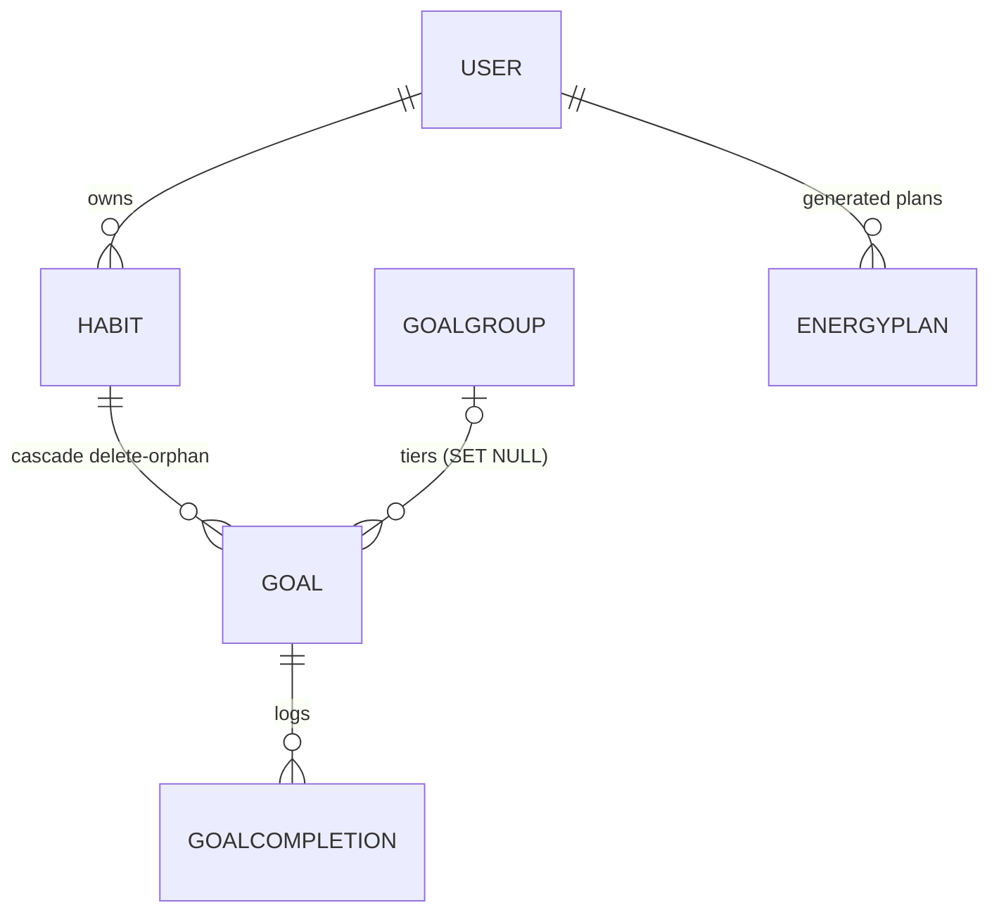

# Data model — habits, goals, energy

Models: `Habit`, `Goal`, `GoalGroup`, `GoalCompletion`, `EnergyPlan` — the
habit-scaffolding ring's tables. The shape is a three-level tree
(habit → goals → completions) plus a durable idempotency store for
generated energy plans.



## `Habit` (`backend/src/models/habit.py`)

| Field | Type | Constraints / column | Default | Purpose |
| --- | --- | --- | --- | --- |
| `id` | `int \| None` | primary key | `None` | Habit id (`habit.py:29`) |
| `name` | `str` | `max_length=255` | — | Display name (`habit.py:30`) |
| `icon` | `str` | `max_length=100` | — | Emoji/icon token (`habit.py:31`) |
| `start_date` | `date` | — | — | When tracking began (`habit.py:32`) |
| `energy_cost` | `int` | — | — | Energy the habit costs (`habit.py:33`) |
| `energy_return` | `int` | — | — | Energy the habit returns (`habit.py:34`) |
| `user_id` | `int` | FK `user.id`, `ondelete="CASCADE"` | — | Owner (`habit.py:35`) |
| `notification_times` | `list[str] \| None` | `PG_ARRAY(String)`, nullable | `None` | Reminder times (`habit.py:36-38`) |
| `notification_frequency` | `str \| None` | `max_length=20` | `None` | Reminder cadence (`habit.py:39`) |
| `notification_days` | `list[str] \| None` | `PG_ARRAY(String)`, nullable | `None` | Reminder days (`habit.py:40-42`) |
| `milestone_notifications` | `bool` | — | `False` | Milestone-alert opt-in (`habit.py:43`) |
| `sort_order` | `int \| None` | — | `None` | Manual ordering (`habit.py:44`) |
| `stage` | `str` | `max_length=100` | `""` | APTITUDE stage the habit belongs to (`habit.py:45`) |
| `streak` | `int` | — | `0` | Cached streak counter (`habit.py:46`) |
| `revealed` | `bool` | — | `False` | Unlock flag — see below (`habit.py:47`) |
| `is_carryover` | `bool` | — | `False` | Pre-program habit partition flag (`habit.py:48`) |

Two flags carry product semantics (`backend/src/models/habit.py:17-26`):

```python
    ``revealed`` is the single source of truth for whether a habit is unlocked
    ("unlocked" == ``revealed is True`` in product terms). New and seeded
    habits default to locked; the user opts each one in. Re-locking (flipping
    ``revealed`` back to ``False``) preserves logged completions — those live
    on the habit's goals, never on this flag — so a re-locked habit keeps its
    history for when the user unlocks it again.

    ``is_carryover`` marks a habit the user brought into APTITUDE from before
    the program: ``True`` keeps it on its own partition (tracked without
    consuming a program stage), ``False`` a regular program habit.
```

**Relationships**: `user` (back-populates `User.habits`, `habit.py:49`);
`goals` with `cascade="all, delete-orphan"` — deleting a habit deletes its
goals (`habit.py:50-53`). **Migrations**: `e6f7a8b9c0d2_add_habit_revealed`,
`c2d3e4f5a6b7_add_habit_is_carryover`,
`b5c6d7e8f9a0_habit_unique_user_lower_name` (case-insensitive per-user name
uniqueness) in `backend/migrations/versions/`.

## `Goal` (`backend/src/models/goal.py`)

A single measurable target for a habit. Goals are additive (reach or
exceed the target, e.g. 8 cups of water) or subtractive (stay under it,
e.g. caffeine ≤ 200 mg); tiered goals sharing a `target_unit` are grouped
via `goal_group_id` so all tiers evaluate against the same logged
completions (`goal.py:23-37`).

| Field | Type | Constraints / column | Default | Purpose |
| --- | --- | --- | --- | --- |
| `id` | `int \| None` | primary key | `None` | Goal id (`goal.py:39`) |
| `habit_id` | `int` | FK `habit.id`, `ondelete="CASCADE"`, not null | — | Parent habit (`goal.py:40-42`) |
| `title` | `str` | `max_length=255` | — | Display title (`goal.py:43`) |
| `description` | `str \| None` | `max_length=2000` | `None` | Free text (`goal.py:44`) |
| `tier` | `str` | `max_length=50` | — | `low` / `clear` / `stretch`; validated as `GoalTier` at the schema layer, not the DB (`goal.py:14-19,45`) |
| `target` | `float` | — | — | Target quantity (`goal.py:46`) |
| `target_unit` | `str` | `max_length=50` | — | Unit ("minutes", "reps", …) (`goal.py:47`) |
| `frequency` | `float` | — | — | e.g. `2.0` = 2x per `frequency_unit` (`goal.py:48`) |
| `frequency_unit` | `str` | `max_length=50` | — | `"per_day"` / `"per_week"` (`goal.py:49`) |
| `days_of_week` | `list[str] \| None` | `PG_ARRAY(String)`, nullable | `None` | Scheduled days (`goal.py:50-53`) |
| `track_with_timer` | `bool` | — | `False` | Timer-tracked goal (`goal.py:54`) |
| `timer_duration_minutes` | `int \| None` | — | `None` | Timer length (`goal.py:55`) |
| `origin` | `str \| None` | `max_length=255` | `None` | Provenance label (`goal.py:56`) |
| `goal_group_id` | `int \| None` | FK `goalgroup.id`, `ondelete="SET NULL"`, nullable | `None` | Tier-group membership (`goal.py:57-64`) |
| `is_additive` | `bool` | — | `True` | Additive vs subtractive evaluation (`goal.py:66`) |

**Relationships**: `goal_group` (back-populates `GoalGroup.goals`,
`goal.py:65`), `habit` (`goal.py:67`), `completions` (`goal.py:68`).
**Migrations**: `c3d4e5f6a7b8_goal_tier_enum`,
`a1b2c3d4e5f6_goal_group_id_ondelete_set_null`
(`backend/migrations/versions/`).

## `GoalGroup` (`backend/src/models/goal_group.py`)

Logical grouping for related goals — the tier container. Its invariant is
enforced at the DB level (`backend/src/models/goal_group.py:18-24`):

```python
    __table_args__ = (
        CheckConstraint(
            "(shared_template = true AND user_id IS NULL) "
            "OR (shared_template = false AND user_id IS NOT NULL)",
            name="ck_goalgroup_shared_template_user_id",
        ),
    )
```

Shared templates (`shared_template=True`) must be ownerless; user-owned
groups must have an owner (`goal_group.py:13-15`).

| Field | Type | Constraints / column | Default | Purpose |
| --- | --- | --- | --- | --- |
| `id` | `int \| None` | primary key | `None` | Group id (`goal_group.py:26`) |
| `name` | `str` | `max_length=255` | — | Group name (`goal_group.py:27`) |
| `icon` | `str \| None` | `max_length=100` | `None` | Icon token (`goal_group.py:28`) |
| `description` | `str \| None` | `max_length=2000` | `None` | Free text (`goal_group.py:29`) |
| `user_id` | `int \| None` | FK `user.id`, `ondelete="SET NULL"`, nullable | `None` | Owner, or `NULL` for shared templates (`goal_group.py:30`) |
| `shared_template` | `bool` | CHECK above | `False` | Template flag (`goal_group.py:31`) |
| `source` | `str \| None` | `max_length=255` | `None` | Provenance label (`goal_group.py:32`) |

**Migration**: `b2c3d4e5f6a7_goalgroup_shared_template_check`
(`backend/migrations/versions/`).

## `GoalCompletion` (`backend/src/models/goal_completion.py`)

One log of engagement with a goal — the app's highest-write table
(`goal_completion.py:30-33`). Day success: for additive goals all logs in
a day are summed and the day succeeds if `total >= target`; for
subtractive goals if `total < target` (`goal_completion.py:17-20`).

| Field | Type | Constraints / column | Default | Purpose |
| --- | --- | --- | --- | --- |
| `id` | `int \| None` | primary key | `None` | Row id (`goal_completion.py:36`) |
| `goal_id` | `int` | FK `goal.id`, `ondelete="CASCADE"`, not null | — | Logged goal (`goal_completion.py:37-39`) |
| `user_id` | `int` | FK `user.id`, `ondelete="CASCADE"` | — | Logger (`goal_completion.py:40`) |
| `timestamp` | `datetime` | `DateTime(timezone=True)`, not null | `datetime.now(UTC)` | UTC log instant (`goal_completion.py:41-44`) |
| `local_day` | `date` | `Date`, not null | `datetime.now(UTC).date()` | User-local calendar day — uniqueness key (`goal_completion.py:45-48`) |
| `completed_units` | `float` | — | — | Units logged (`goal_completion.py:49`) |
| `via_timer` | `bool` | — | `False` | Logged from the timer (`goal_completion.py:50`) |

`local_day` decouples the per-day uniqueness contract from UTC clock time:
a migration-owned unique index over `(goal_id, user_id, local_day)`
guarantees one completion per goal per user-local day, independent of the
row's UTC `timestamp` (`goal_completion.py:22-25`; migration
`f7a8b9c0d1e3_goal_completion_local_day`). The composite hot-path index is
declared on the model so `alembic check` sees no drift
(`backend/src/models/goal_completion.py:34`):

```python
    __table_args__ = (Index("ix_goalcompletion_goal_user_ts", "goal_id", "user_id", "timestamp"),)
```

created by migration `c1d2e3f4a5b6_add_goalcompletion_composite_index`
(issue #466) — every streak/stats read filters on `goal_id`/`user_id` and
orders by `timestamp` (`goal_completion.py:28-33`).

## `EnergyPlan` (`backend/src/models/energy_plan.py`)

Durable storage for generated energy plans. Plans previously lived in a
per-process `TTLCache` — lost on restart, and under multiple workers the
same `idempotency_key` yielded different plans; this table makes a keyed
retry return the stored plan verbatim (`energy_plan.py:1-11`).

| Field | Type | Constraints / column | Default | Purpose |
| --- | --- | --- | --- | --- |
| `id` | `int \| None` | primary key | `None` | Row id (`energy_plan.py:58`) |
| `user_id` | `int` | FK `user.id`, index, `ondelete="CASCADE"` | — | Plan owner (`energy_plan.py:59`) |
| `idempotency_key` | `str \| None` | `String(255)`, nullable | `None` | Client key; `NULL` for unkeyed requests (`energy_plan.py:60-63`) |
| `plan_json` | `str` | `Text`, not null | — | Serialized `schemas.energy.EnergyPlan` (`energy_plan.py:64-67`) |
| `reason_code` | `str` | `String(64)`, not null | — | Generator's reason (e.g. `generated_21_day_plan`) (`energy_plan.py:25-26,68`) |
| `created_at` | `datetime` | `DateTime(timezone=True)`, not null | `datetime.now(UTC)` | Generation instant (`energy_plan.py:69-72`) |

Keyed requests are deduplicated by a partial UNIQUE index
`ix_energyplan_user_idem_key` over `(user_id, idempotency_key)` where the
key is non-NULL (`energy_plan.py:47-56`); a concurrent duplicate insert
raises `IntegrityError` and the caller re-reads the stored row
(`energy_plan.py:40-43`). `IDEM_KEY_MAX_LENGTH = 255` is public so the
router can reject an over-long `X-Idempotency-Key` with a clean 422
instead of a native DB error (`energy_plan.py:20-24`). **Migration**:
`c8d9e0f1a2b3_add_energy_plan` (`backend/migrations/versions/`).

## Related

- [api/habits](../api/habits.md), [api/goals](../api/goals.md),
  [api/goal-groups](../api/goal-groups.md),
  [api/goal-completions](../api/goal-completions.md),
  [api/energy](../api/energy.md)
- [domain/streaks](../domain/streaks.md),
  [domain/habit-stats](../domain/habit-stats.md),
  [domain/energy](../domain/energy.md), [domain/dates](../domain/dates.md)

---

*Grounded in adepthood@fbc529d, 2026-07-31.*
