# Backend data model

Complete reference for every SQLModel table class in
`backend/src/models/`. **Covers all 36 model files — 37 table classes**
(`practice_recipe.py` defines both `PracticeRecipe` and
`PracticeRecipeStep`), enumerated from
`backend/src/models/__init__.py:3-38` and the directory listing, not
sampled. Schema history lives in the 70 Alembic migrations under
`backend/migrations/versions/` (`backend/alembic.ini:8` points
`script_location` at `%(here)s/migrations`); each cluster page names the
migrations that shaped its tables.

## Cluster pages

| Page | Models |
| --- | --- |
| [Identity & auth](identity-auth.md) | `User`, `AuthIdentity`, `RevokedToken`, `LoginAttempt`, `PasswordResetToken` |
| [Preferences & invitations](preferences-invitations.md) | `UserDepthPreferences`, `UserUiFlags`, `InvitationSignal` |
| [Habits, goals, energy](habits-goals.md) | `Habit`, `Goal`, `GoalGroup`, `GoalCompletion`, `EnergyPlan` |
| [Practice](practice.md) | `Practice`, `UserPractice`, `PracticeRecipe`, `PracticeRecipeStep`, `PracticeSession`, `PracticeSessionSpend`, `PracticeShareLink`, `PracticeTag` |
| [Course & program progress](course-content.md) | `CourseStage`, `StageContent`, `StageProgress`, `ContentCompletion`, `PromptResponse` |
| [Journal & reflection](journal-reflection.md) | `JournalEntry`, `Marginalia`, `PromotedQuote`, `CompletionSuggestion` |
| [Metta Return](metta-return.md) | `MettaReturnArc`, `MettaReturnHabitRelease`, `MettaReturnOfferDismissal` |
| [Commerce & wallet](commerce-wallet.md) | `Entitlement`, `GumroadSale`, `WalletAudit`, `LLMUsageLog` |

8 clusters × their models = 37 classes; every name exported from
`models/__init__.py.__all__` appears in exactly one cluster page.

## Relationship overview

```mermaid
erDiagram
    USER ||--o{ HABIT : owns
    HABIT ||--o{ GOAL : has
    GOALGROUP |o--o{ GOAL : tiers
    GOAL ||--o{ GOALCOMPLETION : logs
    USER ||--o{ JOURNALENTRY : writes
    JOURNALENTRY ||--o{ MARGINALIA : annotated
    JOURNALENTRY ||--o{ COMPLETIONSUGGESTION : suggests
    JOURNALENTRY ||--o{ PROMOTEDQUOTE : quoted
    USER ||--o| STAGEPROGRESS : clock
    COURSESTAGE ||--o{ STAGECONTENT : content
    STAGECONTENT ||--o{ CONTENTCOMPLETION : read
    USER ||--o{ PROMPTRESPONSE : answers
    PRACTICE ||--o{ USERPRACTICE : selected
    USERPRACTICE ||--o{ PRACTICESESSION : sessions
    PRACTICERECIPE ||--o{ PRACTICERECIPESTEP : steps
    PRACTICE ||--o{ PRACTICESHARELINK : shared
    USER ||--o{ METTARETURNARC : returns
    METTARETURNARC ||--o{ METTARETURNHABITRELEASE : releases
    USER ||--o{ ENTITLEMENT : entitled
    GUMROADSALE |o--o{ ENTITLEMENT : funded
    USER ||--o{ WALLETAUDIT : audited
    USER ||--o{ LLMUSAGELOG : metered
    USER ||--o| USERDEPTHPREFERENCES : prefs
    USER ||--o| USERUIFLAGS : flags
    USER ||--o{ INVITATIONSIGNAL : invited
    USER ||--o{ AUTHIDENTITY : "signs in via"
    USER ||--o{ PASSWORDRESETTOKEN : resets
```

Auth-infrastructure tables with no user FK drawn above: `RevokedToken`
(keyed by JWT `jti`, `backend/src/models/revoked_token.py:31`) and
`LoginAttempt` (keyed by attempted email string,
`backend/src/models/login_attempt.py:18`). Idempotency stores:
`PracticeSessionSpend` (FKs to user + practicesession) and `EnergyPlan`
(FK to user).

## Cross-cutting conventions

- **Timezone-aware timestamps everywhere.** Every datetime column is
  `DateTime(timezone=True)`; migration
  `78b1620cafde_convert_datetime_columns_to_timestamptz` converted the
  legacy columns.
- **Partial unique indexes declared on the model** with both
  `postgresql_where` *and* `sqlite_where`, so `metadata.create_all` gives
  the SQLite test DB the same constraints and `alembic check` sees no
  drift (e.g. `backend/src/models/user_practice.py:29-38`,
  `backend/src/models/invitation_signal.py:90-113`,
  `backend/src/models/entitlement.py:66-76`). The one deliberate
  exception: partial *functional* indexes (e.g. `Practice`'s
  `lower(trim(name))` uniqueness) live only in raw-SQL migrations because
  autogenerate cannot round-trip them
  (`backend/src/models/practice.py:23-30`).
- **CHECK constraints generated from StrEnums** so the DB value set can
  never drift from the Python enum (e.g.
  `backend/src/models/auth_identity.py:55-58`,
  `backend/src/models/journal_entry.py:83-89`,
  `backend/src/models/practice.py:9-17`).
- **Soft delete over hard delete** where history matters:
  `JournalEntry.deleted_at`, `User.deleted_at`, revocation timestamps on
  `Entitlement`, `PracticeShareLink`, `InvitationSignal.dismissed_at`.
- **Encrypted-at-rest text** via `services.journal_encryption.EncryptedString`
  for `JournalEntry.message` and `PromotedQuote.anchor_text`
  (`backend/src/models/journal_entry.py:202`,
  `backend/src/models/promoted_quote.py:57`).
- **Guarded-UPDATE exactly-once claims** instead of locks for money-like
  operations (`GumroadSale.token_pack_credited_at`,
  `PracticeShareLink.use_count`, `EnergyPlan` / `PracticeSessionSpend`
  idempotency uniques).

See ADR [0002 — FastAPI + SQLModel + async + Alembic](../../../decisions/0002-fastapi-sqlmodel-async-alembic.md)
for why this stack.

---

*Grounded in adepthood@fbc529d, 2026-07-31.*
