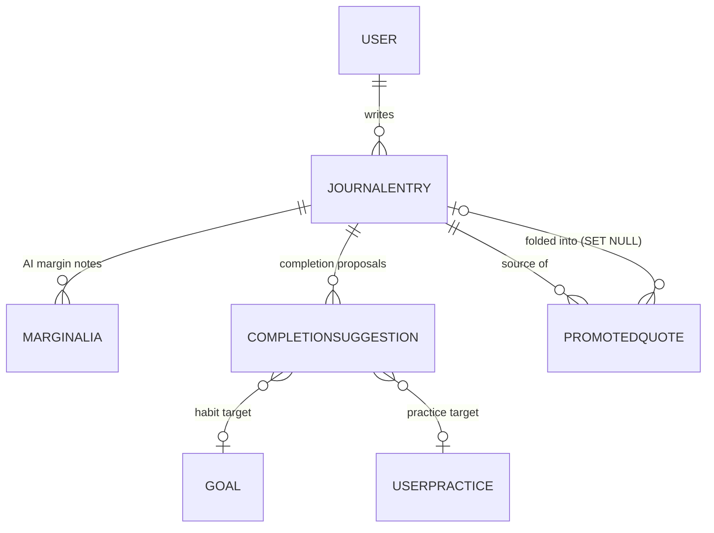

# Data model — journal & reflection

Models: `JournalEntry`, `Marginalia`, `PromotedQuote`,
`CompletionSuggestion` — the journal floor and the resonance artefacts
anchored onto it. `JournalEntry` is the corpus row; the other three all
anchor to character spans of an entry's text.



## `JournalEntry` (`backend/src/models/journal_entry.py`)

A user's journal reflection, optionally paired with an AI resonance
response — `sender == 'bot'` marks an AI reply rather than a chat turn
(`journal_entry.py:136-141`). Hard delete is replaced by soft delete
(BUG-JOURNAL-007) so rows can be recovered within the retention window
and `LLMUsageLog.journal_entry_id` is never orphaned; all read endpoints
filter `deleted_at IS NULL` (`journal_entry.py:143-146`).

### Enums

| Enum | Values | Notes |
| --- | --- | --- |
| `JournalTag` (`journal_entry.py:38-56`) | `freeform`, `stage_reflection`, `practice_note`, `habit_note`, `weekly_prompt`, `hierarchical_reflection` | Plain string column so new values need no migration; Python enum validates at the app layer. `weekly_prompt` keeps stage-scoped aggregates from double-counting prompt submissions (`journal_entry.py:49-52`) |
| `EntryStatus` (`journal_entry.py:59-66`) | `draft`, `finished` | Long-form lifecycle |
| `JournalClassification` (`journal_entry.py:69-80`) | `public`, `personal`, `intimate` | Privacy tier ("you choose your depth", issue #894); `intimate` will be kept away from cloud LLMs (issue #895). DB CHECK pins the set (ADR [0012 — local-first privacy tiers](../../../decisions/0012-local-first-privacy-tiers.md)) |

### Fields

| Field | Type | Constraints / column | Default | Purpose |
| --- | --- | --- | --- | --- |
| `id` | `int \| None` | primary key | `None` | Entry id (`journal_entry.py:191`) |
| `timestamp` | `datetime` | `DateTime(timezone=True)`, not null | `datetime.now(UTC)` | Entry instant; backdatable (`journal_entry.py:192-195`) |
| `message` | `str` | `EncryptedString()`, not null | — | Body, encrypted at rest; the 10k plaintext cap lives at the write boundary, not the column (`journal_entry.py:196-201`) |
| `title` | `str \| None` | `max_length=200` (`JOURNAL_TITLE_MAX_LENGTH`, `journal_entry.py:17-20`) | `None` | Long-form title (`journal_entry.py:204`) |
| `status` | `str` | `max_length=20` | `"draft"` | Draft/finished lifecycle (`journal_entry.py:205`) |
| `classification` | `str` | `max_length=20`, CHECK `ck_journalentry_classification_valid` | `"personal"` | Privacy tier (`journal_entry.py:206-208`) |
| `primary_aspect` | `int \| None` | CHECK `1..TOTAL_STAGES` or NULL | `None` | Chord tagging: primary Aspect (`journal_entry.py:209-213`) |
| `secondary_aspect` | `int \| None` | CHECKs: range + chord shape | `None` | Secondary Aspect; requires a distinct primary (`journal_entry.py:209-213`) |
| `sender` | `str` | `max_length=10` | — | `'user'` or `'bot'` (`journal_entry.py:214`) |
| `user_id` | `int` | FK `user.id`, `ondelete="CASCADE"` | — | Author (`journal_entry.py:215`) |
| `tag` | `str` | `max_length=50` | `"freeform"` | `JournalTag` value (`journal_entry.py:216`) |
| `reflection_level` | `str \| None` | `max_length=20`, CHECK against `ReflectionLevel` | `None` | Which calendar layer this entry closes (`journal_entry.py:217-220`) |
| `reflection_scope_key` | `str \| None` | `max_length=30` | `None` | `c{cycle}:{token}` scope key, paired with level (`journal_entry.py:217-221`) |
| `practice_session_id` | `int \| None` | FK `practicesession.id` | `None` | Linked session (`journal_entry.py:222`) |
| `user_practice_id` | `int \| None` | FK `userpractice.id` | `None` | Linked selection (`journal_entry.py:223`) |
| `vault_ref` | `str \| None` | `String`, nullable | `None` | Opaque handle from a Creek Vault ingest; NULL when never sent (`journal_entry.py:224-231`) |
| `vault_tags` | `list[str] \| None` | `JSON`, nullable | `None` | Frequency / Wavelength-phase tags the vault classified (`journal_entry.py:224-232`) |
| `deleted_at` | `datetime \| None` | nullable, indexed | `None` | Soft delete; `None` = live (`journal_entry.py:233-236`) |
| `updated_at` | `datetime` | not null, `onupdate=now(UTC)` | `datetime.now(UTC)` | Last edit (`journal_entry.py:237-244`) |

### Constraints and indexes (`journal_entry.py:160-189`)

- `ix_journalentry_deleted_at` (migration `a0b1c2d3e4f5`, BUG-JOURNAL-007).
- `ix_journalentry_user_sender_deleted` (migration `e3f4a5b6c7d8`, issue
  #469) — covers `load_recent_conversation`'s hot chat read filtering on
  `(user_id, sender, deleted_at)` ordered by `id DESC`
  (`journal_entry.py:150-154`).
- `ix_journalentry_user_timestamp_id` (migration `f8a9b0c1d2e3`) — the
  list endpoint orders by `(timestamp DESC, id DESC)` so backdated
  entries sort by date, not insertion id (`journal_entry.py:154-159`).
- CHECKs: classification set; both aspects in `1..TOTAL_STAGES`
  (derived from `domain.constants.TOTAL_STAGES` so the range never drifts
  from the curriculum length, `journal_entry.py:110-118`); chord shape —
  "a secondary with no primary, or one equal to the primary, is rejected"
  (`journal_entry.py:121-132`); reflection level in the `ReflectionLevel`
  set; level and scope key set or unset together
  (`journal_entry.py:101-106`).
- The hierarchical-reflection uniqueness contract is a partial unique
  index over **live** rows only (`backend/src/models/journal_entry.py:170-188`):

```python
        # At most one *live* entry may hold a given (user, scope) coordinate: a
        # partial unique index over live rows (``deleted_at IS NULL``) that
        # excludes NULL scopes, so soft-deleting an entry frees its scope for
        # reuse and freeform (scopeless) entries never collide.
        Index(
            "ix_journalentry_user_reflection_scope",
            "user_id",
            "reflection_scope_key",
            unique=True,
            postgresql_where=and_(
                _REFLECTION_SCOPE_COLUMN.is_not(None),
                _DELETED_AT_COLUMN.is_(None),
            ),
            ...
        )
```

**Relationships** (`journal_entry.py:245-263`): `user`; `marginalia`,
`suggestions` (both `cascade="all, delete-orphan"`); `promoted_quotes`
binds only the source side and must name `foreign_keys` because
`PromotedQuote` carries two FKs back to `journalentry`
(`journal_entry.py:254-263`).

**Migrations** (all in `backend/migrations/versions/`):
`a0b1c2d3e4f5_journal_soft_delete`, `b7c8d9e0f1a2_encrypt_journal_messages`,
`d4c3b2a1f6e5_journalentry_document_fields` (title/status/updated_at),
`d8e9f0a1b2c3_add_journalentry_classification`,
`a5b6c7d8e9f0_add_journalentry_chord_aspects`,
`c4f7a2b8d9e1_hierarchical_reflection_scope_and_promoted_quote`,
`c7d8e9f0a1b3_journalentry_vault_ref_tags`.

## `Marginalia` (`backend/src/models/marginalia.py`)

An AI margin note the resonance feature anchors to a character span of a
journal entry, optionally expanded into an essay (`marginalia.py:1-6`).

| Field | Type | Constraints / column | Default | Purpose |
| --- | --- | --- | --- | --- |
| `id` | `int \| None` | primary key | `None` | Note id (`marginalia.py:82`) |
| `journal_entry_id` | `int` | FK `journalentry.id`, `ondelete="CASCADE"`, indexed | — | Anchored entry (`marginalia.py:83`) |
| `user_id` | `int` | FK `user.id`, `ondelete="CASCADE"`, indexed | — | Denormalized owner so per-user reads need no JOIN (`marginalia.py:84-87`) |
| `kind` | `str` | `max_length=20`, CHECK `ck_marginalia_kind_valid` | — | `theme` / `connection` / `symbol` (`MarginaliaKind`, `marginalia.py:23-28,88`) |
| `anchor_start` | `int` | `ge=0`, CHECK non-negative | — | Span start offset (`marginalia.py:89`) |
| `anchor_end` | `int` | `ge=1`, CHECK `anchor_end > anchor_start` | — | Span end offset (`marginalia.py:90`) |
| `anchor_text` | `str` | `max_length=280` | — | Snapshot of the spanned substring — survives edits (`marginalia.py:18,91`) |
| `note` | `str` | `max_length=600` | — | The margin note (`marginalia.py:19,92`) |
| `essay` | `str \| None` | `max_length=10000`, CHECK paired with timestamp | `None` | Optional expansion (`marginalia.py:20,93`) |
| `essay_generated_at` | `datetime \| None` | nullable | `None` | Set together with `essay` or not at all (`ck_marginalia_essay_timestamp_paired`, `marginalia.py:75-79,94-97`) |
| `status` | `str` | `max_length=20`, CHECK `ck_marginalia_status_valid` | `"active"` | `active` anchors cleanly; `stale` = underlying text drifted (`MarginaliaStatus`, `marginalia.py:31-39,98`) |
| `created_at` / `updated_at` | `datetime` | not null; `updated_at` has `onupdate` | `datetime.now(UTC)` | Timestamps (`marginalia.py:99-110`) |

CHECKs exist so a non-ORM writer cannot persist an invalid kind/status or
inverted span (`marginalia.py:62-65`). Migration:
`f6e5d4c3b2a1_add_marginalia`; staleness handling in
[domain/marginalia-anchoring](../domain/marginalia-anchoring.md).

## `PromotedQuote` (`backend/src/models/promoted_quote.py`)

A quote the user promoted from one entry to carry into another: anchors a
span of a source entry, snapshots the text, and optionally records the
entry it was folded into (`promoted_quote.py:1-7,26-35`).

| Field | Type | Constraints / column | Default | Purpose |
| --- | --- | --- | --- | --- |
| `id` | `int \| None` | primary key | `None` | Quote id (`promoted_quote.py:48`) |
| `user_id` | `int` | FK `user.id`, `ondelete="CASCADE"` | — | Owner (`promoted_quote.py:49`) |
| `source_entry_id` | `int` | FK `journalentry.id`, `ondelete="CASCADE"`, indexed | — | Entry lifted from (`promoted_quote.py:50`) |
| `anchor_start` | `int` | `ge=0`, CHECK | — | Span start (`promoted_quote.py:51`) |
| `anchor_end` | `int` | `ge=1`, CHECK `> anchor_start` | — | Span end (`promoted_quote.py:52`) |
| `anchor_text` | `str` | `EncryptedString()`, not null | — | Encrypted snapshot; `PROMOTED_QUOTE_TEXT_MAX = 1000` plaintext cap enforced at the write boundary (`promoted_quote.py:20-23,53-57`) |
| `included_in_entry_id` | `int \| None` | FK `journalentry.id`, `ondelete="SET NULL"` | `None` | Entry folded into; NULL while pending (`promoted_quote.py:58-62`) |
| `stale` | `bool` | — | `False` | Set when a source edit removed/mutated the passage; only pending quotes go stale (`promoted_quote.py:63-67`) |
| `created_at` / `updated_at` | `datetime` | not null; `onupdate` on `updated_at` | `datetime.now(UTC)` | Timestamps (`promoted_quote.py:68-79`) |

Indexes: `ix_promotedquote_source_entry_id`,
`ix_promotedquote_user_included` (`promoted_quote.py:41-46`). The
`source_entry` relationship must name `foreign_keys` — two FKs point back
to `journalentry`, and `included_in_entry_id` is a bare FK column with no
relationship of its own (`promoted_quote.py:80-87`). Migrations:
`c4f7a2b8d9e1_hierarchical_reflection_scope_and_promoted_quote`,
`a9b0c1d2e3f4_add_promoted_quote_stale`.

## `CompletionSuggestion` (`backend/src/models/completion_suggestion.py`)

The resonance pass's proposal that a journal span attests to completing a
habit goal or a user-practice (habit-resonance-01). Anchors like
`Marginalia`, but links to exactly one polymorphic target and carries an
accept→dismiss lifecycle (`completion_suggestion.py:1-8`).

| Field | Type | Constraints / column | Default | Purpose |
| --- | --- | --- | --- | --- |
| `id` | `int \| None` | primary key | `None` | Suggestion id (`completion_suggestion.py:110`) |
| `journal_entry_id` | `int` | FK `journalentry.id`, `ondelete="CASCADE"`, indexed | — | Anchored entry (`completion_suggestion.py:111`) |
| `user_id` | `int` | FK `user.id`, `ondelete="CASCADE"`, indexed | — | Denormalized owner (`completion_suggestion.py:112-114`) |
| `target_type` | `str` | `max_length=20`, CHECK valid | — | `habit` or `practice` (`CompletionTargetType`, `completion_suggestion.py:26-30,115`) |
| `goal_id` | `int \| None` | FK `goal.id`, `ondelete="CASCADE"`, nullable, indexed | `None` | Set iff `target_type='habit'` (`completion_suggestion.py:117-120`) |
| `user_practice_id` | `int \| None` | FK `userpractice.id`, `ondelete="CASCADE"`, nullable, indexed | `None` | Set iff `target_type='practice'` (`completion_suggestion.py:121-124`) |
| `label` | `str` | `max_length=255` | — | Display label for the proposal (`completion_suggestion.py:125`) |
| `anchor_start` | `int` | `ge=0`, CHECK | — | Span start (`completion_suggestion.py:126`) |
| `anchor_end` | `int` | `ge=1`, CHECK `> anchor_start` | — | Span end (`completion_suggestion.py:127`) |
| `anchor_text` | `str` | `max_length=280` | — | Span snapshot (`completion_suggestion.py:128`) |
| `status` | `str` | `max_length=20`, CHECK valid | `"pending"` | `pending` → `accepted` / `dismissed`; decided is terminal (`SuggestionStatus`, `completion_suggestion.py:33-42,129`) |
| `accepted_at` | `datetime \| None` | nullable | `None` | Acceptance instant (`completion_suggestion.py:130-133`) |
| `created_at` / `updated_at` | `datetime` | not null; `onupdate` | `datetime.now(UTC)` | Timestamps (`completion_suggestion.py:134-145`) |

The polymorphic target is kept honest at the DB level
(`backend/src/models/completion_suggestion.py:71-75`):

```python
    return CheckConstraint(
        "(target_type = 'habit' AND goal_id IS NOT NULL AND user_practice_id IS NULL)"
        " OR (target_type = 'practice' AND user_practice_id IS NOT NULL AND goal_id IS NULL)",
        name="ck_completion_suggestion_target_fk_matches",
    )
```

Both target FKs are indexed because Postgres does not auto-index FK
columns and reverse lookups ("pending suggestions for goal X") must be
range scans (`completion_suggestion.py:90-93`). Migrations:
`a3b4c5d6e7f9_add_completion_suggestion`,
`c5d6e7f8a9b0_index_completion_suggestion_target_fks`.

## Related

- [api/journal](../api/journal.md), [api/reflections](../api/reflections.md),
  [api/promotions](../api/promotions.md), [api/botmason](../api/botmason.md)
- [domain/resonance](../domain/resonance.md),
  [domain/detection](../domain/detection.md),
  [domain/marginalia-anchoring](../domain/marginalia-anchoring.md),
  [domain/reflection-hierarchy](../domain/reflection-hierarchy.md),
  [domain/creek-vault](../domain/creek-vault.md)

---

*Grounded in adepthood@fbc529d, 2026-07-31.*
