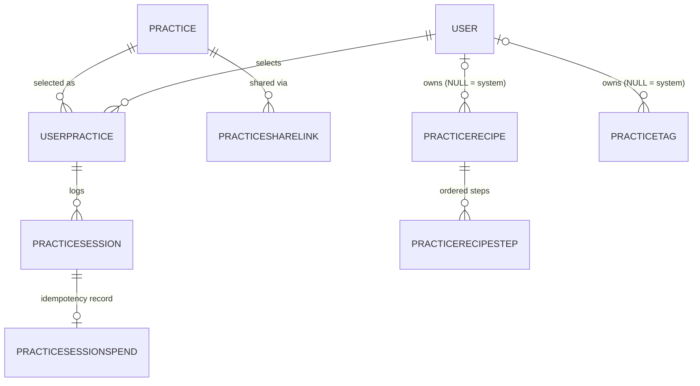

# Data model — practice

Models (7 files, 8 table classes): `Practice`, `UserPractice`,
`PracticeRecipe` + `PracticeRecipeStep`, `PracticeSession`,
`PracticeSessionSpend`, `PracticeShareLink`, `PracticeTag` — the
practice-ramp ring: a catalog of practices, per-user selections with
overrides, session logs with idempotent creation, recipes/tags for the
customise flow, and share links.



## `Practice` (`backend/src/models/practice.py`)

The catalog row: one practice users can perform, with an engine-mode
discriminator and per-mode config.

| Field | Type | Constraints / column | Default | Purpose |
| --- | --- | --- | --- | --- |
| `id` | `int \| None` | primary key | `None` | Practice id (`practice.py:35`) |
| `stage_number` | `int` | — | — | APTITUDE stage the practice belongs to (`practice.py:36`) |
| `name` | `str` | `max_length=255` | — | Display name (`practice.py:37`) |
| `description` | `str` | `max_length=2000` | — | Short description (`practice.py:38`) |
| `instructions` | `str` | `max_length=10000` | — | Full instructions (`practice.py:39`) |
| `default_duration_minutes` | `float` | — | — | Suggested duration (`practice.py:40`) |
| `submitted_by_user_id` | `int \| None` | FK `user.id`, `ondelete="SET NULL"` | `None` | `NULL` = seeded/system; set = user-submitted (`practice.py:41-43`) |
| `approved` | `bool` | — | `True` | Moderation flag (`practice.py:44`) |
| `mode` | `str` | `max_length=32`, CHECK `ck_practice_mode_valid` | `"meditation_timer"` | Engine discriminator; see [domain/practice-modes](../domain/practice-modes.md) (`practice.py:45-49`) |
| `mode_config` | `dict[str, Any]` | `JSON`, not null, `server_default="{}"` | `{}` | Per-mode config validated against `schemas.practice_mode_config.ModeConfig` at the API edge (`practice.py:50-57`) |

The mode CHECK is generated from `domain.practice_modes.ALL_MODES` so
adding a new mode is a one-edit change — the constraint and the enum
cannot drift (`practice.py:9-17`). A partial functional unique index on
`(stage_number, lower(trim(name))) WHERE submitted_by_user_id IS NULL`
exists only at the DB layer (migration `d2e3f4a5b6c7`) and is
intentionally **not** in `__table_args__`: alembic autogenerate cannot
round-trip a partial functional index, so declaring it would flag false
drift; regression tests in `backend/tests/test_seed_practices.py` exercise
it instead (`practice.py:23-30`). Mode-history migrations:
`e9f0a1b2c3d4_practice_mode_and_mode_config`,
`a1b2c3d4e5f7_add_tallied_grounding_mode`,
`a2b3c4d5e6f8_add_card_meditation_mode`,
`b6c7d8e9a0b1_add_random_interval_bell_mode`,
`f4a5b6c7d8e9_add_mindful_anchor_mode` (`backend/migrations/versions/`).

## `UserPractice` (`backend/src/models/user_practice.py`)

Connects a user to a selected `Practice` for a given stage and tracks the
engagement window (`user_practice.py:14-17`).

| Field | Type | Constraints / column | Default | Purpose |
| --- | --- | --- | --- | --- |
| `id` | `int \| None` | primary key | `None` | Row id (`user_practice.py:40`) |
| `user_id` | `int` | FK `user.id`, `ondelete="CASCADE"` | — | Selecting user (`user_practice.py:41`) |
| `practice_id` | `int` | FK `practice.id` | — | Selected catalog row (`user_practice.py:42`) |
| `stage_number` | `int` | — | — | Stage of the selection (`user_practice.py:43`) |
| `start_date` | `date` | — | — | Window start (`user_practice.py:44`) |
| `end_date` | `date \| None` | `Date`, nullable | `None` | `NULL` = still active (`user_practice.py:45`) |
| `custom_name` | `str \| None` | `max_length=255` | `None` | Per-user display name; falls back to `Practice.name` (`user_practice.py:46-50`) |
| `mode_config_override` | `dict[str, Any] \| None` | `JSON`, nullable | `None` | Per-user override of `Practice.mode_config`, validated against the catalog mode by `domain.practice_resolution` (`user_practice.py:54-61`) |

The single-active-selection invariant is enforced at the database level
(BUG-PRACTICE-005, BUG-PRACTICE-011) by a partial unique index
(`backend/src/models/user_practice.py:29-38`):

```python
    __table_args__ = (
        Index(
            "ix_user_practice_active_stage",
            "user_id",
            "stage_number",
            unique=True,
            postgresql_where=_END_DATE_COLUMN.is_(None),
            sqlite_where=_END_DATE_COLUMN.is_(None),
        ),
    )
```

`end_date IS NULL` is the canonical "still active" predicate, so closed
selections accumulate as history while the live selection stays a single
row (`user_practice.py:19-26`; migration `f6a7b8c9d0e1`). `mode` itself is
deliberately not overridable — the override only swaps fields *within*
the catalog mode (`user_practice.py:51-53`). Migration:
`83b01b64cad3_user_practice_overrides` added the override columns.

## `PracticeRecipe` and `PracticeRecipeStep` (`backend/src/models/practice_recipe.py`)

Recipes are named ordered collections of steps that materialise into a
`mode_config` at apply time — the user-facing unit of the tier-one
customise flow (e.g. `5-4-3-2-1 Grounding`, `Find the Rainbow`)
(`practice_recipe.py:1-7`). System recipes (`owner_user_id IS NULL`) are
seeded read-only; the client's "edit" flow forks a user copy instead of
mutating the shared row (`practice_recipe.py:9-11`).

### `PracticeRecipe`

| Field | Type | Constraints / column | Default | Purpose |
| --- | --- | --- | --- | --- |
| `id` | `int \| None` | primary key | `None` | Recipe id (`practice_recipe.py:97`) |
| `slug` | `str` | `max_length=64` | — | Snake-case machine slug; pattern enforced by the schema layer (`practice_recipe.py:98-101`) |
| `name` | `str` | `max_length=255` | — | Display name (`practice_recipe.py:102`) |
| `description` | `str` | `max_length=2000` | — | Free text (`practice_recipe.py:103`) |
| `owner_user_id` | `int \| None` | FK `user.id`, `ondelete="CASCADE"` | `None` | `NULL` = system recipe (`practice_recipe.py:104-109`) |
| `mode` | `str` | `max_length=32`, CHECK `ck_practicerecipe_mode_valid` | — | Target mode; restricted to `sense_grounding` / `tallied_grounding` (`RECIPE_MODES`, `practice_recipe.py:49-58,110-113`) |
| `rounds` | `int` | CHECK `1 <= rounds <= 10` (`ck_practicerecipe_rounds_range`) | `1` | Recipe-level rounds; always 1 for `sense_grounding` (`practice_recipe.py:20-23,76-79,114`) |
| `created_at` | `datetime` | `DateTime(timezone=True)`, not null | `datetime.now(UTC)` | For "added today" in the picker (`practice_recipe.py:70-71,115-118`) |

Partial-unique slug indexes split the system and per-user namespaces:
`ix_practicerecipe_system_slug` (unique `slug` where owner IS NULL) and
`ix_practicerecipe_user_slug` (unique `(owner_user_id, slug)` where owner
IS NOT NULL) (`practice_recipe.py:80-94`; migration `07b8c9d0e1f2`).
Apply refuses cross-mode swaps — the override mechanism cannot change
`mode` (`practice_recipe.py:13-18`). Rounds/step bounds are mirrored from
`schemas.practice_mode_config` so the DB CHECK and the Pydantic validator
agree; drift would surface as a 500 (`practice_recipe.py:38-45`).

### `PracticeRecipeStep`

| Field | Type | Constraints / column | Default | Purpose |
| --- | --- | --- | --- | --- |
| `id` | `int \| None` | primary key | `None` | Step id (`practice_recipe.py:153`) |
| `recipe_id` | `int` | FK `practicerecipe.id`, `ondelete="CASCADE"` | — | Parent recipe; deliberately not `index=True` — the composite unique index's leftmost prefix covers the lookup (`practice_recipe.py:154-157`) |
| `position` | `int` | CHECK `position >= 0` | — | Zero-based ordering (`practice_recipe.py:150,158`) |
| `tag_slug` | `str` | `max_length=64` | — | Copy of the originating tag's slug — not an FK (`practice_recipe.py:159`) |
| `tag_label` | `str` | `max_length=255` | — | Copy of the tag's label (`practice_recipe.py:160`) |
| `prompt_label` | `str` | `max_length=255` | — | Prompt shown for the step (`practice_recipe.py:161`) |
| `target_count` | `int` | CHECK `1 <= target_count <= 20` (`ck_practicerecipestep_target_count_range`) | `1` | Count target for the step (`practice_recipe.py:143-149,162`) |

`(recipe_id, position)` is unique (`ix_practicerecipestep_recipe_position`,
`practice_recipe.py:137-142`). Tag fields are copies rather than FKs so a
recipe keeps working after the user deletes the personal tag it was built
from, and a system recipe stays self-contained (`practice_recipe.py:124-129`).

## `PracticeSession` (`backend/src/models/practice_session.py`)

A single session log linked to a `UserPractice` selection, used for
consistency evaluation (target: minimum 4x/week) plus ritual-04
mode-aware analytics (`practice_session.py:14-19`).

| Field | Type | Constraints / column | Default | Purpose |
| --- | --- | --- | --- | --- |
| `id` | `int \| None` | primary key | `None` | Session id (`practice_session.py:34`) |
| `user_id` | `int` | FK `user.id`, `ondelete="CASCADE"` | — | Logger (`practice_session.py:35`) |
| `user_practice_id` | `int` | FK `userpractice.id` | — | Selection the session belongs to (`practice_session.py:36`) |
| `duration_minutes` | `float` | — | — | Session length (`practice_session.py:37`) |
| `timestamp` | `datetime` | `DateTime(timezone=True)`, not null | `datetime.now(UTC)` | Session instant (`practice_session.py:38-41`) |
| `reflection` | `str \| None` | `max_length=5000` | `None` | Long-form reflection (`practice_session.py:42`) |
| `mode` | `str` | `max_length=32` | `"meditation_timer"` | Resolved mode, denormalized at write time (`practice_session.py:43-47`) |
| `mode_metadata` | `dict[str, Any] \| None` | `JSON`, nullable | `None` | Engine outputs (rep_count, bpm_used, …) validated by `schemas.practice_session_metadata.SessionMetadata` (`practice_session.py:48-55`) |
| `completed` | `bool` | — | `True` | `False` if cancelled before the target (`practice_session.py:56-59`) |
| `insight` | `str \| None` | `max_length=2000` (`_INSIGHT_MAX_LENGTH`, `practice_session.py:9-11`) | `None` | Short takeaway, distinct from `reflection` (`practice_session.py:60`) |

`mode` is denormalized so the insights rollup can filter without a join —
and so a future catalog edit cannot retro-rewrite session history
(`practice_session.py:21-23`). Partial sessions still count toward weekly
totals iff their duration is positive (`practice_session.py:27-29`).
Migration: `f0a1b2c3d4e5_practice_session_metadata`.

## `PracticeSessionSpend` (`backend/src/models/practice_session_idempotency.py`)

DB-backed idempotency store for practice-session creation, replacing a
per-process `dict` that only deduplicated within one worker
(`practice_session_idempotency.py:1-8`).

| Field | Type | Constraints / column | Default | Purpose |
| --- | --- | --- | --- | --- |
| `id` | `int \| None` | primary key | `None` | Row id (`practice_session_idempotency.py:42`) |
| `user_id` | `int` | FK `user.id`, index, `ondelete="CASCADE"` | — | Requesting user (`practice_session_idempotency.py:43`) |
| `idem_key` | `str` | `String(128)`, not null, index | — | SHA-256 of `(user_id, raw_key)`; the raw header is never stored (`practice_session_idempotency.py:33-34,44-46`) |
| `session_id` | `int` | FK `practicesession.id`, `ondelete="CASCADE"` | — | The deduplicated session (`practice_session_idempotency.py:47-51`) |
| `created_at` | `datetime` | `DateTime(timezone=True)`, not null | `datetime.now(UTC)` | Record instant (`practice_session_idempotency.py:52-55`) |

`UNIQUE (user_id, idem_key)` (`uq_practicesessionspend_user_idem_key`,
`practice_session_idempotency.py:38-40`) lets the database serialise the
check-then-insert race across workers. Unlike the chat spend path there
is no in-flight tombstone: practice-session writes are fast and
synchronous, so the row is inserted in the same transaction as the
session and always carries a real `session_id`
(`practice_session_idempotency.py:10-13`). `ondelete="CASCADE"` on
`session_id` means deleting a session drops its idempotency record, so a
later replay logs a fresh session (`practice_session_idempotency.py:47-50`).
Migration: `d0e1f2a3b4c5_add_practice_session_idempotency`.

## `PracticeShareLink` (`backend/src/models/practice_share_link.py`)

A long-random URL-safe token bound to one source practice; the token
itself is the secret (`practice_share_link.py:1-10`).

| Field | Type | Constraints / column | Default | Purpose |
| --- | --- | --- | --- | --- |
| `id` | `int \| None` | primary key | `None` | Row id (`practice_share_link.py:58`) |
| `token` | `str` | `unique`, index, `max_length=64`, not null | — | `secrets.token_urlsafe(32)` — 43 chars, 256 bits of entropy; stored plaintext because it *is* the capability (`practice_share_link.py:38-42,59`) |
| `practice_id` | `int` | FK `practice.id`, `ondelete="CASCADE"`, index | — | Source practice (`practice_share_link.py:60`) |
| `created_by_user_id` | `int \| None` | FK `user.id`, `ondelete="SET NULL"`, index | `None` | Minting owner; SET NULL so audit history survives account deletion (`practice_share_link.py:44-46,61-63`) |
| `created_at` | `datetime` | `DateTime(timezone=True)`, not null | `datetime.now(UTC)` | Mint instant (`practice_share_link.py:64-67`) |
| `expires_at` | `datetime \| None` | nullable | `None` | Optional deadline; past-due fails closed with 410, not 404 (`practice_share_link.py:12-14,68-71`) |
| `max_uses` | `int \| None` | — | `None` | Optional redemption cap (`practice_share_link.py:72`) |
| `use_count` | `int` | not null | `0` | Redemptions so far (`practice_share_link.py:73`) |
| `revoked_at` | `datetime \| None` | nullable | `None` | Set once, never cleared (`practice_share_link.py:19-21,74-77`) |

The cap check is race-free by construction — one guarded UPDATE covers
read, check, and increment (`backend/src/models/practice_share_link.py:48-55`):

```python
    ``use_count`` starts at zero.  The import endpoint issues a single
    ``UPDATE ... SET use_count = use_count + 1 WHERE id = ? AND
    revoked_at IS NULL AND (max_uses IS NULL OR use_count < max_uses)``
    so the read of the current count, the cap check, and the increment
    are all one statement.  Two concurrent imports of a ``max_uses=1``
    link therefore cannot both pass the cap -- the loser's ``rowcount``
    is zero and the endpoint returns 410 ``share_link_exhausted``
    instead of cloning a second copy.
```

Imported practices are independent copies (`approved=False`,
`submitted_by_user_id` = recipient), so revoking a link never
retroactively unshares what already landed (`practice_share_link.py:23-27`).

## `PracticeTag` (`backend/src/models/practice_tag.py`)

Personal tag-library entries for the recipe builder — the smallest unit a
recipe step is built from (`sight`, `red`, `earth`, …): slug + label,
nothing else; styling lives in the client (`practice_tag.py:1-6`).

| Field | Type | Constraints / column | Default | Purpose |
| --- | --- | --- | --- | --- |
| `id` | `int \| None` | primary key | `None` | Tag id (`practice_tag.py:61`) |
| `slug` | `str` | `max_length=64` | — | Snake-case machine slug (`practice_tag.py:62-65`) |
| `label` | `str` | `max_length=255` | — | Display string (`practice_tag.py:66`) |
| `owner_user_id` | `int \| None` | FK `user.id`, `ondelete="CASCADE"` | `None` | `NULL` = system tag owned by the seeder (`practice_tag.py:67-72`) |
| `created_at` | `datetime` | `DateTime(timezone=True)`, not null | `datetime.now(UTC)` | Creation instant (`practice_tag.py:73-76`) |

Partial-unique indexes `ix_practicetag_system_slug` /
`ix_practicetag_user_slug` keep the system and per-user namespaces
independent — a user can claim `sight` even when a system tag with that
slug exists (`practice_tag.py:8-13,43-59`; migration `07b8c9d0e1f2`).
Recipe steps copy the slug rather than FK-ing it, so deleting a personal
tag never silently breaks a recipe (`practice_tag.py:15-17`).

## Related

- [api/practices](../api/practices.md),
  [api/user-practices](../api/user-practices.md),
  [api/practice-sessions](../api/practice-sessions.md),
  [api/practice-recipes](../api/practice-recipes.md),
  [api/practice-tags](../api/practice-tags.md),
  [api/practice-share](../api/practice-share.md)
- [domain/practice-modes](../domain/practice-modes.md),
  [domain/practice-resolution](../domain/practice-resolution.md),
  [domain/practice-insights](../domain/practice-insights.md)

---

*Grounded in adepthood@fbc529d, 2026-07-31.*
