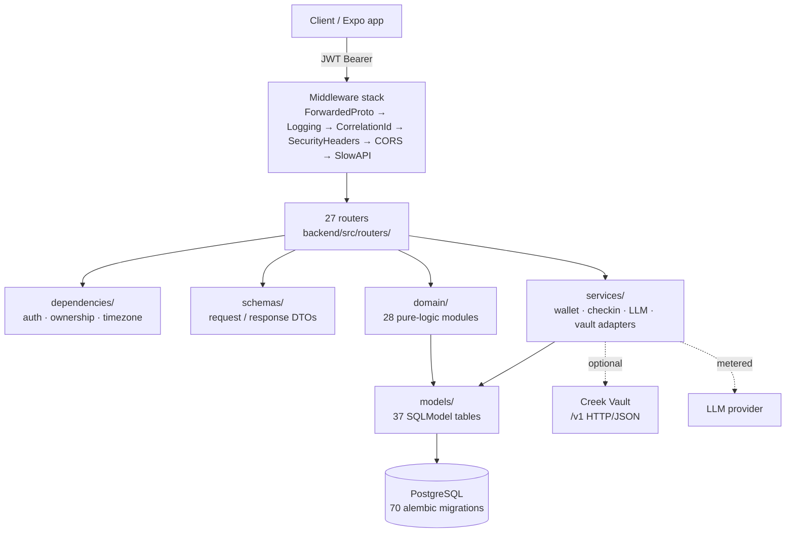

# Adepthood backend — deep reference

A code-grounded reference for the adepthood FastAPI backend
(`backend/src/` in the adepthood monorepo), written by reading the
source — not the READMEs. Every factual claim cites a repo-relative
`file:line`; load-bearing logic is quoted verbatim; enumerable surfaces
are enumerated completely, never sampled.

## Coverage counts (enumerated from source)

| Section | Count | Enumerated from |
| --- | --- | --- |
| [API](api/index.md) | **all 27 routers** | `backend/src/routers/` listing, cross-checked against the 27 `include_router` calls at `backend/src/main.py:592-618` |
| [Data model](data-model/index.md) | **all 36 model files / 37 table classes** | `backend/src/models/__init__.py:3-38` + directory listing |
| [Domain logic](domain/index.md) | **all 28 domain modules** | `backend/src/domain/` listing |
| [Infrastructure](infrastructure.md) | app assembly, DB, seeding, errors, auth mechanics, conftest | `main.py`, `database.py`, `errors.py`, seeders, `conftest.py` |
| Migrations | 70 Alembic revisions | `backend/migrations/versions/` |

## Architecture at a glance

The layering rule visible throughout: routers own HTTP concerns
(auth, ownership, status codes, rate limits), `domain/` owns rules as
pure functions wherever possible, `services/` owns I/O side effects
(wallet, LLM, email, vault), and invariants that matter are enforced
*again* at the database layer (unique/partial indexes, CHECK
constraints) so races and non-ORM writers cannot break them.

## Sections

- **[Data model](data-model/index.md)** — field tables, constraints,
  relationship maps, and the migrations that shaped each of the 37
  table classes, in 8 cluster pages.
- **[API](api/index.md)** — one page per router: complete endpoint
  tables (method, path, auth, DTOs, status codes incl. error details)
  plus the non-obvious behavior (idempotency, enumeration safety, side
  effects).
- **[Domain](domain/index.md)** — one page per module: each algorithm's
  inputs, rules (thresholds, windows, edge cases) with verbatim
  excerpts, and worked examples.
- **[Infrastructure](infrastructure.md)** — lifespan, middleware order,
  CORS, health probes, session plumbing, seeding, error envelope, and
  the test fixtures' guarantees.

Related ADRs: [0002 — FastAPI + SQLModel + async + Alembic](../../decisions/0002-fastapi-sqlmodel-async-alembic.md),
[0004 — JWT auth](../../decisions/0004-jwt-auth.md),
[0006 — graduated engagement](../../decisions/0006-graduated-engagement.md),
[0012 — local-first privacy tiers](../../decisions/0012-local-first-privacy-tiers.md).

---

*Grounded in adepthood@fbc529d, 2026-07-31.*
