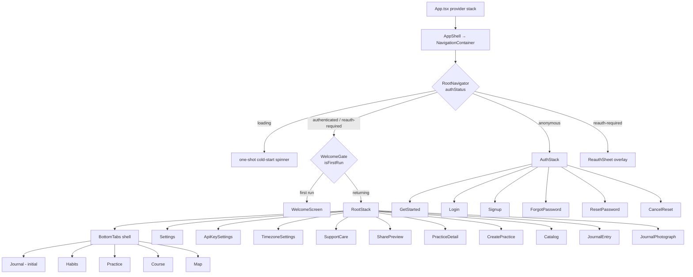

# Navigation

The navigation layer lives in `frontend/src/navigation/` (5 files:
`RootStack.tsx`, `BottomTabs.tsx`, `destinations.ts`, `hooks.ts`,
`theme.ts`) plus the auth-gate and AuthStack in `frontend/src/App.tsx`.
Libraries: React Navigation 7 native-stack and bottom-tabs
(`frontend/src/navigation/RootStack.tsx:2`,
`frontend/src/navigation/BottomTabs.tsx:3`).

## The graph



(If this renders as a code block, `mkdocs.yml` does not yet carry the
superfences mermaid custom-fence config; the tables below are the
authoritative flat form.)

## Auth gate (`RootNavigator`)

The navigator switches on the explicit `authStatus` state machine — never on
the raw token — so a transient 401 shows the `ReauthSheet` overlay instead of
unmounting the app (`frontend/src/App.tsx:129-143,162-190`):

```tsx
if (authStatus === 'loading') { /* one-shot cold-start spinner */ }
if (authStatus === 'anonymous') { return <AuthNavigator key="anon" />; }
// 'authenticated' or 'reauth-required' — RootStack stays mounted in both
return (
  <FeatureErrorBoundary name="App">
    <WelcomeGate />
    {authStatus === 'reauth-required' ? <ReauthSheet /> : null}
  </FeatureErrorBoundary>
);
```

The four states and their transitions are defined in
`frontend/src/context/AuthContext.tsx:43-63`:
`loading → authenticated | anonymous`, `anonymous → authenticated`,
`authenticated → reauth-required | anonymous`, and
`reauth-required → authenticated | anonymous`. `loading` is one-shot — the
machine never rewinds into it mid-session (BUG-NAV-002). The authed and
anonymous subtrees carry distinct React keys (`key="auth"` at
`App.tsx:159`, `key="anon"` at `App.tsx:177`) so login/logout force a full
remount that clears stale route state (BUG-FRONTEND-INFRA-002/003/022,
`App.tsx:138-143`). See
[ADR 0004 — JWT auth](../../decisions/0004-jwt-auth.md).

### Welcome gate

Inside the authenticated branch, `WelcomeGate` shows the editorial first-run
intro above the shell until `useFirstRun` resolves the per-account
`has_seen_welcome` flag; Begin or Skip persists the flag and swaps to
`RootStack`, which mounts at its `Journal` initial route
(`frontend/src/App.tsx:144-160`, hook at
`frontend/src/store/useWelcomeStore.ts:95-123`).

## AuthStack — 6 routes

Declared in `frontend/src/App.tsx:44-53` (param list) and `111-127`
(navigator, `headerShown: false`). `GetStarted` is declared first so an
anonymous visitor lands on the pre-auth surface, not a login form
(`App.tsx:116-119`).

| Route | Screen component | Params | Source |
| --- | --- | --- | --- |
| `GetStarted` | `GetStartedScreen` | — | `App.tsx:119` |
| `Login` | `LoginScreen` | — | `App.tsx:120` |
| `Signup` | `SignupScreen` | `{ licenseKey?: string }` — seeds the form for a buyer arriving with a key | `App.tsx:47-49,121` |
| `ForgotPassword` | `ForgotPasswordScreen` | — | `App.tsx:122` |
| `ResetPassword` | `ResetPasswordScreen` | `{ token?: string }` — from the recovery-email deep link | `App.tsx:51,123` |
| `CancelReset` | `CancelResetScreen` | `{ token?: string }` — the "this wasn't me" landing | `App.tsx:52,124` |

## RootStack — 11 routes

Param list at `frontend/src/navigation/RootStack.tsx:32-71`; navigator at
`111-152`. Screen options apply the warm chrome: terracotta
`headerTintColor` and a serif `headerTitleStyle`
(`RootStack.tsx:77-80`). `Tabs` is typed
`NavigatorScreenParams<RootTabParamList>` so nested navigations like
`navigate('Tabs', { screen: 'Practice', params: … })` are fully typed
(`RootStack.tsx:33,82-93`).

| Route | Screen component | Params | Header title | Source |
| --- | --- | --- | --- | --- |
| `Tabs` | `BottomTabs` | `NavigatorScreenParams<RootTabParamList>` | (hidden) | `RootStack.tsx:113` |
| `Settings` | `SettingsHubScreen` | — | "Settings" | `RootStack.tsx:114` |
| `ApiKeySettings` | `ApiKeySettingsScreen` | — | "API Key" | `RootStack.tsx:115-119` |
| `TimezoneSettings` | `TimezoneSettingsScreen` | — | "Time zone" | `RootStack.tsx:120-124` |
| `SupportCare` | `SupportCareScreen` | — | "Support & care" | `RootStack.tsx:125-129` |
| `SharePreview` | `SharePreviewScreen` | `{ token: string }` | "Shared practice" | `RootStack.tsx:38,130-134` |
| `PracticeDetail` | `PracticeDetailScreen` | `{ practiceId: number; assignError?: string }` | "Practice" | `RootStack.tsx:39,135-139` |
| `CreatePractice` | `CreatePracticeWizard` | `{ prefill?: CreatePracticePrefill } \| undefined` (prefill shape at `RootStack.tsx:23-30`) | "New practice" | `RootStack.tsx:40,140-144` |
| `Catalog` | `PracticeCatalogScreen` | `{ stageNumber?: number } \| undefined` | "Practices" | `RootStack.tsx:41,145-149` |
| `JournalEntry` | `JournalEntryScreen` | rich optional param object: `entryId`, `classification`, `justSaved`, `weekNumber`, `promptQuestion`, `practiceSessionId`, `userPracticeId`, `prefillTitle`, `reflectionLevel`, `reflectionScopeKey`, `prefillQuote`, `returnTo` | "Journal" | `RootStack.tsx:43-70,98-102` |
| `JournalPhotograph` | `JournalPhotographScreen` | — | "Photograph journal" | `RootStack.tsx:42,103-107` |

The two Journal routes are grouped in a `JournalScreens` fragment to keep
the navigator lean (`RootStack.tsx:94-109`). `JournalEntry.returnTo`
carries `{ screen: 'Course', params: { stageNumber?, contentId, scrollOffset } }`
so "Back to reading" restores the reader's scroll position
(`RootStack.tsx:64-68`).

## BottomTabs — 5 destinations, ring-gated

Param list (`frontend/src/navigation/BottomTabs.tsx:30-37`):

```tsx
export type RootTabParamList = {
  Habits: undefined;
  Practice: { stageNumber?: number } | undefined;
  Course: { stageNumber?: number; contentId?: number; scrollOffset?: number } | undefined;
  Journal: undefined;
  Map: undefined;
};
```

### The destinations registry

`NAV_DESTINATIONS` in `frontend/src/navigation/destinations.ts:39-45` is the
single ordered source of truth consumed by both the drawer and the tab
navigator — Journal first, the three optional depth rings in the middle,
Map last:

```tsx
export const NAV_DESTINATIONS: ReadonlyArray<NavDestination> = [
  { name: 'Journal', label: 'Journal', icon: NotebookPen },
  { name: 'Habits', label: 'Habits', icon: Sprout, ring: 'habits' },
  { name: 'Practice', label: 'Practice', icon: Flower2, ring: 'practices' },
  { name: 'Course', label: 'Course', icon: BookOpen, ring: 'course' },
  { name: 'Map', label: 'Map', icon: Compass },
];
```

Each entry may name a `ring` (`'habits' | 'practices' | 'course'`,
`destinations.ts:20`) that must be enabled for the destination to appear.
This is the navigation half of graduated engagement
([ADR 0006](../../decisions/0006-graduated-engagement.md)): rings are on by
default and a user opts *out*.

| Tab | Screen (boundary-wrapped) | Ring flag | Source |
| --- | --- | --- | --- |
| `Journal` (initial) | `JournalShelfScreen` | always shown | `BottomTabs.tsx:61,70,209` |
| `Habits` | `HabitsScreen` | `enable_habits` | `BottomTabs.tsx:58,71,84-88` |
| `Practice` | `PracticeScreen` | `enable_practices` | `BottomTabs.tsx:59,72,84-88` |
| `Course` | `CourseScreen` | `enable_course` | `BottomTabs.tsx:60,73,84-88` |
| `Map` | `MapScreen` | always shown | `BottomTabs.tsx:62,74` |

Every tab screen is wrapped in a `FeatureErrorBoundary` via `withBoundary`
so a render crash in one tab leaves the others usable
(BUG-FRONTEND-INFRA-019, `BottomTabs.tsx:41-62`).

### Ring gating mechanics

- `useVisibleDestinations` subscribes to the three ring selectors on
  `useDepthPreferencesStore` and filters `NAV_DESTINATIONS`; a store flip
  reactively adds/removes the route (`BottomTabs.tsx:93-114`).
- `useLoadDepthPreferences` fetches the server toggles once per token
  (`BottomTabs.tsx:154-161`).
- `RingAwareTabBar` — mounted as the navigator's `tabBar` prop precisely so
  it runs *inside* the navigator — renders `null` (the drawer is primary
  navigation, so no bar is drawn) while hosting `useRingRedirect`
  (`BottomTabs.tsx:116-152`). If the focused tab's ring flag flips off, the
  effect navigates focus to the always-present `Journal`
  (`REDIRECT_TARGET`, `BottomTabs.tsx:81,128-140`):

```tsx
React.useEffect(() => {
  const ringKey = focusedRouteName ? RING_FLAG_BY_ROUTE[focusedRouteName] : undefined;
  const flags: RingEnabledMap = { habits, practices, course };
  if (ringKey && !flags[ringKey]) {
    navigation.navigate(REDIRECT_TARGET);
  }
}, [focusedRouteName, habits, practices, course, navigation]);
```

- The header of every tab carries a Settings gear (`TabHeaderRight`) that
  navigates to the `Settings` hub on the parent stack
  (`BottomTabs.tsx:163-180,193-200`).

## Deep linking

`linking` covers both navigators under the `adepthood://` prefix; whichever
navigator `authStatus` has mounted consumes the matching routes
(`frontend/src/App.tsx:65-109`):

| URL pattern | Route | Notes |
| --- | --- | --- |
| `habits`, `practice/:stageNumber?`, `course/:stageNumber?`, `journal`, `map` | tab routes under `Tabs` | `App.tsx:77-84` |
| `settings` | `Settings` | `App.tsx:86` |
| `api-key-settings` | `ApiKeySettings` | BUG-FRONTEND-INFRA-008, `App.tsx:87` |
| `practices/share/:token` | `SharePreview` | share-link landing (issue #348), `App.tsx:88-92` |
| `get-started`, `login`, `signup`, `forgot-password`, `reset-password`, `cancel-reset` | AuthStack routes | only resolve while `AuthNavigator` is mounted; `reset-password?token=…` feeds `ResetPasswordScreen` (`App.tsx:93-106`) |

## Typed hooks and nav theme

- `useAppNavigation()` / `useAppRoute<T>()` wrap `useNavigation` /
  `useRoute` with `RootTabParamList` typing
  (`frontend/src/navigation/hooks.ts:11-21`).
- `navTheme` / `navThemeDark` extend React Navigation's `DefaultTheme` /
  `DarkTheme` and repaint chrome colors from the Candle & Ink semantic
  tokens (`primary` → `accent.primary`, `background` → `surface.canvas`,
  `card` → `surface.raised`, `text` → `ink.primary`, `border` →
  `surface.hairline`); `navThemeFor(mode)` selects per theme mode
  (`frontend/src/navigation/theme.ts:12-47`). Passed to
  `NavigationContainer` in `AppShell` (`frontend/src/App.tsx:226`).

*Grounded in adepthood@55eef11, 2026-07-31.*
